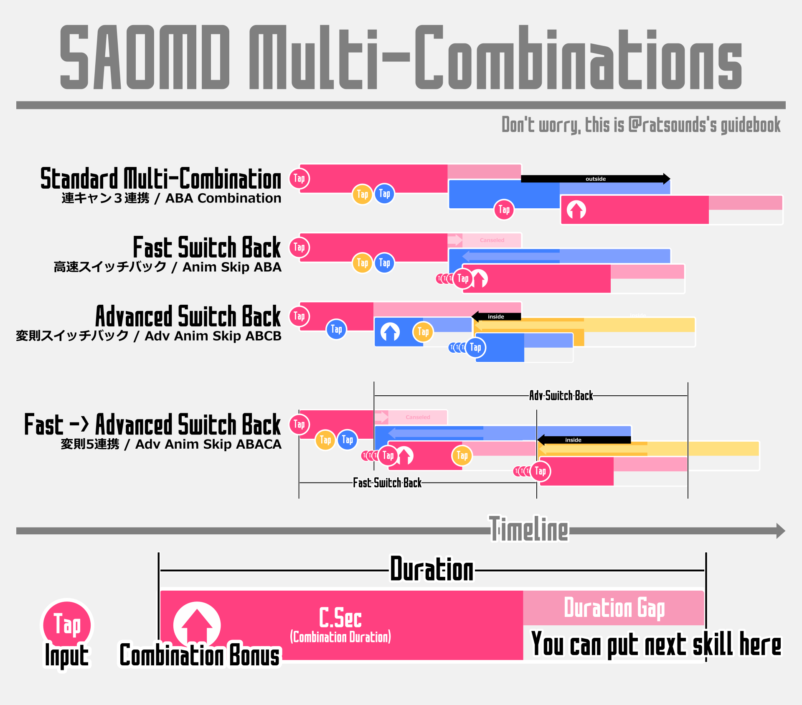

### 리세마라 (Reset Marathon)
> &nbsp;&nbsp;&nbsp;리셋 마라톤의 약칭으로 소셜 게임에서 흔히 볼 수 있는 목표로 하는 캐릭터를 뽑을 때까지 재설치를 반복하는 것을 말합니다. 메모디프에서 추천하는 리세마라 방법은 다른 게임들과 마찬가지로 ↓ 같은 흐름입니다. 초회 반값인 캐릭터와 무기 가챠를 1회씩 돌려서 ★6 캐릭터와 ★4 무기가 갖추어질 때까지 해도 좋습니다.
> 
> 1. 메모디프 설치
> 1. 초회 가챠까지 퀘스트 진행
> 1. 초회 가챠로 [슈퍼아머 캐릭터](#슈아-super-armor)나 신부18(화속신부) 아스나를 얻지 못했다면 1로 돌아갑니다
> 1. SA 캐릭터를 메인으로 다이아 125개를 모아서 초회 반값 가챠를 뽑을 때까지 메인 퀘스트 진행
> 1. 초회 반값 11연 가챠를 돌립니다
> 1. 목표로 하는 캐릭터가 뽑히지 않았다면 삭제하고 1로 돌아갑니다
>
> #### 현재 추천 캐릭터
> &nbsp;&nbsp;&nbsp;랭킹 이벤트 등에서는 속성별로 캐릭터가 필요해서 기본적으로는 퀘스트를 진행하기 편해지는(슈퍼아머・즉시회복・베리어)로 시작하는 것이 좋습니다.
> - [슈퍼아머 캐릭터](#슈아-super-armor) 전반(★6이나 ★5로 진화가 가능한 캐릭터가 이상적입니다. ★4로 타협해도 괜찮습니다)
> - ★6 확정 가챠. 베리어x2 또는 슈퍼아머 캐릭터를 겨냥
> - 신부18 아스나(【겉잡을 수 없는 애정】 아스나). 거의 화면 전체를 커버하는 추적탄으로 공격해서 잡몹 사냥이 폭발적으로 빨라집니다.
>
> #### 함정
> - 초반 메인 캐릭터로 지팡이는 추천하지 않습니다.
> - 현재 최신 캐릭터는 ★6이므로 다이아 250개로 뽑는 ★5 확정은 거르고 최신 가챠의 초회 반값을 노리는 쪽이 좋습니다. SAO게임 5주년 가챠도 컬렉션 목적이 아니라면 추천하지 않습니다.
> - 보스의 속성에 유효한 캐릭터를 뽑을 필요가 있으므로, 무과금으로 무기 가챠를 돌리다 보면 캐릭터가 부족해집니다. 다이아를 절약하려면 무기는 될 수 있으면 이벤트로 실시하는 확정 가챠만 뽑도록 합니다.

### 초기에 해야 할 일 (Guide for Newbie)
> - 리세마라 종료 후에는 메인 캐릭터가 SS3을 사용할 수 있게 되는 Lv50까지 일단 토끼 사냥이랑 해방 결정을 모으러 가도 좋습니다. SS3을 사용할 수 있게 되면 슈퍼아머 캐릭터는 특히 편해집니다.
> - SS3을 사용할 수 있게 되었다면 일단 장비 생성 퀘스트에서 장비를 갖추면 좋습니다. 덧붙여서 퀘스트 패널을 길게 누르면 보스나 드롭 아이템의 정보를 볼 수 있으므로, 특히 액세서리나 방어구는 메인 캐릭터와 속성이 일치하는 장비가 드롭하는 퀘스트를 선택하도록 합니다.
> - 캐릭터 세 명을 Lv80까지 육성을 완료하기 전까지는 솔로로 플레이해도 상관없습니다.
> - 익숙해질 때까지 멀티는 슈아 캐릭터를 메인으로 해도 상관없습니다. 대미지를 입히지 못하더라도 누적된 콤보를 유지할 수 있다면 좋습니다. 거기에 패리를 할 수 있다면 더욱 좋습니다. 다른 플레이어의 액셀로 인해 패리와 회피를 하기 어려워지는 만큼, ★6으로 슈아 버프를 다시 받으려면 가급적 보스의 공격 모션 경직에 맞춰서 사용합니다. 첫 번째 슈아 버프를 받기 전에 넘어지지 않도록 시작 직후의 보스 움직임은 한 번쯤 예습해 둡시다.
> - 배포 캐릭터를 받을 수 있는 캐릭터 육성 이벤트는 퀘스트에서 충분히 사용할 수 있는 성능의 ★5 캐릭터를 얻을 수 있으므로 힘내서 확보합니다. 절급 이후에는 솔로로 돌기 힘든 퀘스트도 있으니 멀티에서 도는 것이 좋습니다. 현재 캐릭터 육성 이벤트는 복각 위주라 멀티에 사람이 모이지 않을 때는 SNS를 활용해서 모집합니다.
> - R5 방어구용 프래그먼트, 배포 ★4 무기용 소드 프래그먼트, 캐릭터 강화용 무지개 물방울은 이벤트에서 배포하는 양이 제한되어 있고 부족해지기 쉬우므로 최대한 확보해둡니다.
> - 메모디프는 이벤트 갱신 주기가 짧아서 공략 사이트를 꾸준히 운영하기 어려워서 정보를 SNS(특히 Twitter)에 강하게 의존하고 있으므로, [Twitter의 #メモデフ 태그](://twitter.com/search?q=%23%E3%83%A1%E3%83%A2%E3%https83%87%E3%83%95&src=typd)나 [Lobi의 메모디프 커뮤(일본어)](https://web.lobi.co/game/sao_md), [Sword Art Online: Memory Defrag Subreddit(영어)](https://www.reddit.com/r/MemoryDefrag/)를 활용합니다. 메모디프에서 공략 정보를 수집하는 것이라면 특히 Twitter는 구경하는 것만으로도 유용하니, 사용할 수 있게 되면 좋습니다.
> - 그 밖의 캐릭터 데이터베이스 적인 용도는 [메모디프 비망록(일본어)](https://game.stamp.pink/)이나 [SAO:MD Data Base(해외)](https://saomd-fanadata.fr/)등이 있습니다.

### 경험치 파밍 (Exp Farming)
> &nbsp;&nbsp;&nbsp;육성할 때는 토끼 사냥이나 16-2를 계속 주회합니다.  
> &nbsp;&nbsp;&nbsp;신부18 아스나가 있다면 토끼 사냥은 상급 쪽이 빠릅니다.

### 레벨 언락 키 파밍 (Key Farming)
> &nbsp;&nbsp;&nbsp;되도록 70과 80레벨 키는 EP 퀘스트에서 교환해 두는 것이 좋습니다. 그래도 부족할 때에는 다음 표를 참조하세요. 난이도는 전부 노말이어도 OK. 10-70까지 전체적으로 모으고 싶다면 육성 Col 초월급을 돌면 됩니다.
> 
> |레벨|퀘스트|보충|
> |:--:|:--:|--|
> |10|2-7||
> |20|3-9||
> |30|4-9||
> |40|7-7||
> |50|7-9||
> |60|9-5||
> |70|16-2|랜덤|
> |80|16-2|랜덤|
> |10-70|육성 Col 초월급|랜덤|

### 해방 결정과 Col 파밍 (Crystal Farming & Col Farming)
> &nbsp;&nbsp;&nbsp;보통은 요일 퀘스트로. 부족한 경우에는 상설 퀘스트로. Col은 상설에 있는 Alicization 캐릭터 소개 퀘스트의 "앨리시제이션 편 절급"을 계속 주회합니다. 장비가 갖추어졌다면 신부18 아스나로 스킬을 난사해서 쓰러뜨릴 수 있는 난이도입니다.
> 
> |종류|속성|요일|상설|
> |:--:|:--:|:--:|:--:|
> |DEF|암|월|17-4|
> |ATK|화|화|16-2|
> |MP|수|수|17-7|
> |HP|풍|목|17-6|
> |스킬|신성|금|17-1|
> |CRI|토|토|17-3|
> |콜|무|일|앨리시제이션 편 절급|

### 한계 돌파 (Limit Break)
> &nbsp;&nbsp;&nbsp;캐릭터는 레어리티에 따라 한계가 존재하며 한계 레벨을 넘어서 추가로 레벨을 올리기 위해서는 한계 돌파가 필요합니다. 한계 돌파는 합계 4회가 가능하며 1회마다 레벨 상한이 5 오릅니다.  
> &nbsp;&nbsp;&nbsp;또한, 한계 돌파마다 공격 타입, MP 타입, 방어 타입을 선택할 수 있는데, 별다른 이유가 없다면 공격으로 하면 됩니다. 예를 들어서 MP를 1, 2회 한돌해서 MP 회복 없이 스킬을 사용할 수 있는 횟수가 늘어날 때는 MP 한돌을 고려합니다.
> 
> &nbsp;&nbsp;&nbsp;공격 한돌을 선택할 때는 ATK, MP 한돌을 할 때는 MP가 증가하지만, 여는 슬롯에 따라서 증가량에 최대 1의 오차가 생깁니다. 특히 MP 한돌은 1의 오차가 중요해서 한돌을 하는 순서에 주의해야 합니다. 공격 한돌을 할 때의 ATK, MP 한돌을 할 때의 MP 증가량은 다음과 같이 계산할 수 있습니다.
> 
> #### 성장곡선 보통
> 
> |한돌 종류|한돌x4에 의한 증가량|보충|
> |:-:|--|--|
> |ATK|${ATK}{\times}{한돌 횟수}{\times}0.025775$|80레벨 이후에는 1레벨이 오를 때 ${ATK}{\times}0.005245$ 증가|
> |MP|${ceiling}({MP}{\times}0.158)$|★5 이후로는 별다른 예외는 보이지 않지만, 특히 초기 일부 캐릭터는 이 규칙을 벗어날 때가 있습니다.|
> 
> &nbsp;&nbsp;&nbsp;천사 유이 이전의 랭킹 이벤트 보수 캐릭터의 상당수는 성장곡선이 높고, 이러한 캐릭터는 한계 돌파에 의한 스테이터스 증가율이 높습니다. 레벨에 따른 증가율은 같습니다.
> 
> #### 성장곡선 높음
> 
> |한돌 종류|한돌x4에 의한 증가량|보충|
> |:-:|--|--|
> |ATK|${ATK}{\times}{한돌 횟수}{\times}0.041275$|레벨업에 따른 증가율은 그대로입니다.|
> |MP|불명|데이터 부족|
> 
> &nbsp;&nbsp;&nbsp;각 한돌 슬롯을 열었을 때의 증가량은 앞에 서술한 한돌x4 증가량을 4로 나눈 나머지가 다음의 우선순위에 따라 배정됩니다.
>
> #### 한돌 슬롯에 의한 잉여 배분 우선순위
> 
> |한돌 횟수|1凸|2凸|3凸|4凸|
> |:-:|:-:|:-:|:-:|:-:|
> |우선순위|4|2|3|1|
> 
> &nbsp;&nbsp;&nbsp;구체적인 예로 한돌x4 증가량이 40부터 44인 경우를 아래에 나타냈습니다. 
> 
> #### 한돌 슬롯에 의한 잉여 배분 우선순위
> 
> |한돌 횟수|÷|나머지|1凸|2凸|3凸|4凸|
> |:-:|:-:|:-:|:-:|:-:|:-:|:-:|
> |한돌x4증가량=40|10|0|10|10|10|10|
> |한돌x4증가량=41|10|1|10|10|10|11|
> |한돌x4증가량=42|10|2|10|11|10|11|
> |한돌x4증가량=43|10|3|10|11|11|11|
> |한돌x4증가량=44|11|0|11|11|11|11|
 

### 한돌 (LB)
> [한계 돌파](#한계-돌파-limit-break)를 말합니다.

### 레어리티 표기 (Rarity Notation)
> &nbsp;&nbsp;&nbsp;캐릭터의 레어리티와 무기의 레어리티를 혼동하지 않도록 캐릭터의 레어리티는 ★5나 ★6, 무기와 방어구는 R4나 R5로 표기하는 경우가 많습니다.

### 한계 돌파 표기 (Limit Break Notation)
> &nbsp;&nbsp;&nbsp;lv100을 전부 공격으로 했을 때는 올공 한돌, 전부 MP로 했을 때는 올마나 한돌 등으로 부릅니다. 일반적으로 아무것도 표기하지 않았을 때는 공격 한돌입니다.  
> &nbsp;&nbsp;&nbsp;공격 한돌과 MP 한돌, MP 한돌을 한 위치 등을 정확하게 표기할 때는 공격 한돌을 A, MP 한돌으로 M으로 해서, 예를 들어 3번째까지 공격 한돌이고 4번째만 MP 한돌일 경우에는 AAAM 등으로 표기합니다.

### 스킬 슬롯 표기 (Skill Slot Notation)
> &nbsp;&nbsp;&nbsp;스킬 슬롯의 해방 상황을 표기하기 위해서 해방이 끝난 스킬 슬롯 레벨을 왼쪽부터 차례대로 "-"로 나눈 숫자로 표기합니다.  
> &nbsp;&nbsp;&nbsp;예: 왼쪽부터 무기 스킬, 속성 대미지 UP, 콤보 대미지, 콤보 지속시간 증가 스킬 슬롯을 가지고 있고, 무기 레벨과 콤보 지속시간 증가만 해방했을 때는 5-0-0-1로 표기합니다.

### R5무기의 스테이터스 (Stats of R5 Weapon)
> &nbsp;&nbsp;&nbsp;R4에서 진화한 R5무기의 스테이터스는 1.36배에 가깝습니다.

### 장비와 속성 (Equipment and Element)
> &nbsp;&nbsp;&nbsp;캐릭터 속성과 장비 속성이 일치할 때는 장비의 스테이터스가 1.2배가 됩니다. 장비 속성과 적의 속성은 대미지 보정에 아무런 관련이 없고, 캐릭터 속성과 적의 속성으로만 보정이 걸립니다.

### 속성 궁합 (Elemental Relations)
> &nbsp;&nbsp;&nbsp;속성 상성은 아래의 속성 궁합 표대로. 기본적으로 유리한 속성은 1.5배 정도, 불리할 때는 0.75배 정도로 대미지가 증감합니다.
> 
> #### 속성 상성 표
>
> |적|무|신성|암|화|수|풍|토|
> |:--:|:--:|:--:|:--:|:--:|:--:|:--:|:--:|
> |타격&nbsp;대미지&nbsp;상승|무※|암|신성|수|토|화|풍|
> |피격&nbsp;대미지&nbsp;하락||||수|토|화|풍|
> |타격&nbsp;대미지&nbsp;하락||||풍|화|토|수|
> |피격&nbsp;대미지&nbsp;상승||암|신성|풍|화|토|수|

### MP 회복량 (MP Recovery)
> &nbsp;&nbsp;&nbsp;MP 회복량은 무기마다, 일반 공격 1회 마다 최대 MP에 따른 MP 회복률이 정해져 있으며 다음과 같이 계산할 수 있습니다.
> 
> $${\it MP 회복량}=floor({\it MP 회복률}\cdot{\it 최대 MP})$$
> 
> &nbsp;&nbsp;&nbsp;또한, 목적인 MP 회복률에 필요한 최대 MP는 다음과 같이 구할 수 있습니다.
> 
> $${\it 필요한 최대 MP}={ceiling}({\it MP 회복량}/{\it MP 회복률})$$
> 
> &nbsp;&nbsp;&nbsp;각 무기 종류별의 MP 회복률과 특정 MP 회복량이 되는 최소, 최대 MP 표는 다음과 같습니다.
> 
> #### MP 회복 표
>
> | |세검 단검 창|한손검 쌍검 방패검|한손몽둥이|활|총|지팡이 자동소총
> |:--:|:--:|:--:|:--:|:--:|:--:|:--:|:--:
> |MP 회복률|4.0%|5.0%|7.0%|6.0%|10.0%|2.0%
> |1|25|20|15|17|10|50
> |2|50|40|29|34|20|100
> |3|75|60|43|50|30|150
> |4|100|80|58|67|40|200
> |5|125|100|72|84|50|250
> |6|150|120|86|100|60|300
> |7|175|140|100|117|70|350
> |8|200|160|115|134|80|400
> |9|225|180|129|150|90|450
> |10|250|200|143|167|100|500
> |11|275|220|158|184|110|550
> |12|300|240|172|200|120|600
> |13|325|260|186|217|130|650
> |14|350|280|200|234|140|700
> |15|375|300|215|250|150|750
> |16|400|320|229|267|160|800
> |17|425|340|243|284|170|850
> |18|450|360|258|300|180|900
> |19|475|380|272|317|190|950
> |20|500|400|286|334|200|1000
> |21|525|420|300|350|210|1050
> |22|550|440|315|367|220|1100
> |23|575|460|329|384|230|1150
> |24|600|480|343|400|240|1200
> |25|625|500|358|417|250|1250
> |26|650|520|372|434|260|1300
> |27|675|540|386|450|270|1350
> |28|700|560|400|467|280|1400
> |29|725|580|415|484|290|1450
> |30|750|600|429|500|300|1500
> |31|775|620|443|517|310|1550
> |32|800|640|458|534|320|1600
> |33|825|660|472|550|330|1650
> |34|850|680|486|567|340|1700
> |35|875|700|500|584|350|1750
> |36|900|720|515|600|360|1800
> |37|925|740|529|617|370|1850
> |38|950|760|543|634|380|1900
> |39|975|780|558|650|390|1950
> |40|1000|800|572|667|400|2000

### 컷인 ON/OFF (Cut-in ON/OFF)
> &nbsp;&nbsp;&nbsp;컷인을 ON/OFF 하는 것으로 적의 HP가 0이 되었을 때의 움직임이 달라지므로 목적에 따라서 구분해서 사용합니다. 컷인을 ON 했을 때는 적의 HP가 0이 되어도 적이 사라지지 않고 연속으로 공격을 맞아서 콤보 수가 늘어납니다.  
> &nbsp;&nbsp;&nbsp;한편으로는 적이 출현하는 조건이 앞의 적을 쓰러뜨리는 것으로 되어있을 때는 출현하는 타이밍이 늦어집니다. (스테이지에 따라서는 타이머가 멈추기 때문에 인 게임 시간상으로 디메리트는 적습니다) 랭킹 이벤트 보스는 HP가 0이 되었을 때 움직임이 달라질 때도 있습니다.
> <blockquote class="twitter-tweet" data-conversation="none"><a href="https://twitter.com/ratsounds/status/863807949931552768">[ref]</a></blockquote>

### 계층 공략 (Floor Clearing Event)
> &nbsp;&nbsp;&nbsp;솔로 전용 콘텐츠로는 비교적 난이도가 높은 이벤트. 현재는 대체로 월마다 복각하면서 로테이션 중입니다. 귀중한 R5 방어구 용 프래그먼트를 한꺼번에 얻을 수 있고, 다이아 입수량도 많으니 노력해서 클리어하면 좋습니다. 단순한 클리어와는 별개로 캐릭터나 무기를 제한해서 챌린지 해야지 얻을 수 있는 칭호도 있습니다.  
> &nbsp;&nbsp;&nbsp;계층 공략을 진행하는 데 있어 유용한 지식은 다방면에 걸쳐 있지만, 일반적이고 넓게 응용할 수 있는 정보만 아래에 기술했습니다. 예를 들어 챌린지나 특정 보스의 공략 정보 등은 Twitter의 [#階層攻略(계층 공략)](https://twitter.com/search?q=%23%E9%9A%8E%E5%B1%A4%E6%94%BB%E7%95%A5&src=typd) 태그와 각 챌린지 마다 "#◯◯チャレンジ"라는 태그를 아울러서 참조하면 좋습니다.
> 
> #### 캐릭터 배분 전략
> &nbsp;&nbsp;&nbsp;자신의 캐릭터나 무기 수량을 고려하면서, 되도록 캐릭터의 출격 횟수를 낭비하지 않도록 배분할 필요가 있습니다. 클리어 시간에 따른 다이아 회수도 필요하므로 기본적으로 잡몹전에서는 캐릭터를 아끼면서 시간이 걸리는 보스전에서 강한 캐릭터를 사용합니다.  
> &nbsp;&nbsp;&nbsp;잡몹전에서는 리자드나 독 슬라임 등, 죽기 쉬운 스테이지에 대응해서 베리어나 자기 회복 등의 캐릭터를 사용합니다(슈아는 되도록 보스전에서 사용하면 좋습니다).  
> &nbsp;&nbsp;&nbsp;보스전에서는 슈아나 베리어, 회복을 할 수 있거나 공격에 맞기 어려운 모션을 가진 캐릭터를 메인 캐릭터로 이용하고, 다른 2 캐릭터를 화력 요원으로만 사용하는 것이 유효합니다.
> 
> #### 잡몹 처리에 강한 캐릭터 목록
> 
> |이름|보충|
> |--|--|
> |X사치|HP 회복이 붙은 광범위하고 길게 지속되는 SS3으로, MP소모 대비 효율도 높은데 배포 캐릭터.|
> |요리 아스나|진화하면서 약간 X사치와 비슷한 SS3이 되었습니다.|
> |신부18&nbsp;아스나|잡몹 처리 성능이 급이 다를 정도로 좋고 회복 효과가 있습니다. 다만 방심하면 리자드맨 같은 곳에서 마비 때문에 허무하게 죽을지도 모릅니다.|
> |FB&nbsp;리즈|SS3의 추적 성능이 2계통이나 있어서 자동소총이어도 사용하기 편하고 회복도 붙어있습니다.|
> |몬스트&nbsp;앨리스|회복이 붙은 자동소총 캐릭터이며 배포.|
> |멀티플&nbsp;체이서를&nbsp;가지고&nbsp;있는&nbsp;활|체이서는 활의 SS1이나 SS2, ★3의 SS3으로 설정된 다운 수치가 이상하게 높은 소드 스킬. 기본적으로 잡몹은 한방에 다운되니까 MP 회수력도 높은 것을 이용해서 일어나려고 할 때 연속으로 다운시켜서 처치할 수 있습니다.|
> |베리어|리자드와 싸울 때는 마비공격 때문에 허무하게 죽는 경우가 많아서 베리어 캐릭터를 사용하는 쪽이 안정적입니다.|
> |회복|독을 사용하는 잡몹과 싸울 때.|
> |지팡이|SS1로 회복용으로 사용하며, 방어구와 액세서리만 착용하고 다음 스테이지로 이동하기 전에 운용합니다.|
>
> #### 리자드 대처 방법
> &nbsp;&nbsp;&nbsp;혀의 마비 공격이나 화면 밖에서 날아오는 돌진 공격으로 허무하게 죽기 쉽습니다. 가능하면 베리어나 슈아 캐릭터를 사용하면 좋습니다. 베리어 캐릭터가 회복을 가지고 있지 않을 때는 지팡이 캐릭터로 서포트합니다.  
> &nbsp;&nbsp;&nbsp;베리어나 슈아 캐릭터를 사용할 수 없을 때는 SS3을 쓰려고 애쓰는 것보다는 SS1 등으로 다운시키는 쪽이 안정적인 경우가 많습니다. 세검의 SS1이 추천. 또는 자동소총으로 가로축이 겹치지 않게 도망 다니거나, 한손몽둥이의 PG(프로텍션 가드) 등으로 어떻게든 처리하는 것도 유효합니다.
>
> #### 슬라임 대처 방법
> &nbsp;&nbsp;&nbsp;무적이 되는 기술이 있고 비교적 빠른 점프 공격도 있어서 여러 마리가 출현하면 고생할 수 있습니다. 여러 마리가 출현했을 때는 피격 없이 통과하는 것이 어려우므로, 가능하면 회복할 수 있는 캐릭터를 추천합니다.  
> &nbsp;&nbsp;&nbsp;근거리에서 사용하는 점프 공격 이외에는 이동 속도가 느리므로 일단 거리를 벌리고 회복을 하는 것도 유효합니다.
> 
> #### 개구리 대처 방법
> &nbsp;&nbsp;&nbsp;독 거품을 사용하는 타입을 정면에서 상대하려면 꽤 번거롭습니다. 범위와 다운 수치가 높은 캐릭터를 선택하고 거품을 뱉기 전에 다운시켜서 쓰러뜨립니다.  
> &nbsp;&nbsp;&nbsp;쌍검과 활, 총 등의 MP 회수율이 높은 무기일 때는 몹이 다운된 상태에서 다음 SS3을 사용할 MP 회수가 가능하므로 무기를 장비하지 않아도 어떻게든 잡을 수 있습니다.
>
> #### 보스전 공략
> &nbsp;&nbsp;&nbsp;기본적으로 메인 캐릭터+나머지 2 캐릭터 구성이 리스크가 낮습니다. 나머지 2 캐릭터 구성은 단순하게 화력 캐릭터로 2명을 넣는 경우, 버프 캐릭터를 넣는 경우가 있습니다.  
> &nbsp;&nbsp;&nbsp;예를 들어 삼귀신 캐릭터처럼 메인 캐릭터가 화력이 높은 경우에는 버프 캐릭터 2명이면 됩니다. 반대로 메인 캐릭터의 화력이 낮은 경우에는 화력 요원 2명, 또는 버프+화력 구성이 바람직합니다.
>
> #### 전략적 철수
> &nbsp;&nbsp;&nbsp;한 명이 쓰러졌을 때 출격 횟수에 여유가 있으면 강한 캐릭터를 한 번 더 사용할 수 있으니 전멸하기 전에 철수하는 것이 좋습니다.
> 
> #### 전략적 좀비
> &nbsp;&nbsp;&nbsp;마지막 층 같은 곳에서는 남은 캐릭터 전원으로 쓰러트리면 되므로, 퀘스트 시작부터 전원이 스킬을 퍼부은 다음에 즉시 철수를 반복하는 전략입니다.  
> &nbsp;&nbsp;&nbsp;약한 캐릭터라고 해도 출격 횟수가 남아 있으면 2회 이상 사용할 수 있으니 캐릭터가 죽기 전에 항복하는 것이 포인트입니다.
> 
> #### 보스전 전투용 캐릭터 목록(SA이외)
> 
> |속성|이름|보충|
> |--|--|--|
> |무||
> |신성|신부17 유우키|
> |신성|검성 시논|
> |암|삼귀신 시논|
> |암|세계수 키리토|
> |암|T(테일즈) 키리토|
> |암|할로윈16 시논|
> |화|신년 시논|
> |화|신부18 앨리스|
> |수|삼귀신 유우키|
> |풍|초복 캐릭터|
> |토|어린이 레인|
> |토|어린이 시논|
> |토|오딘 키리토|
> |토|초목화 시논|
> 
> #### 보스전 회복 캐릭터 목록
> 
> |이름|보충|
> |--|--|
> |V18&nbsp;필리아|전체 회복에 스위치 SS3이라 긴급한 상황에 사용하기 좋습니다.|
> |수영복&nbsp;유나|전체 회복을 가지고 있습니다.|
> |비&nbsp;아스나|전체 회복 SS3을 가지고 있지만 콤보 지속이 없으므로 주의.|
> |V18&nbsp;캐릭터|선 연계 회복을 가지고 있습니다.|
> 

### 시간 제한 배틀 (Time Limit Battle)
> 
> #### 궁극전 코볼트 로드 (Ultimate Fight Kobold Lord)
> &nbsp;&nbsp;&nbsp;슈아 무효 공격이나 버프 해제, 한방 가드 브레이크가 있고 대부분 즉사기여서 베리어 캐릭터가 안정적입니다. 방어력이 높으므로 디버프가 유효합니다. 후반은 스턴SS3으로 기절시킬 수 있지만 베리어 캐릭터로 파티를 짜는 것이 안정성이 오릅니다.  
> &nbsp;&nbsp;&nbsp;점프 이지선다 공격은 사전에 타겟을 해놓으면 녹색 타겟 서클이 바닥에 보이니 잊지 말고 첫 패리 후에 연계할 때 타겟 설정을 해놓읍시다.
>
> ##### 야태도 포효 전
> &nbsp;&nbsp;&nbsp;포효 후에는 MP 회수가 어려워지는 경향이 있으니 전반에는 스킬을 적당히 사용하면서 MP를 유지하는 것이 안정적입니다. 화력도 있고 MP 회복이 가능한 FB 유지오와 FB 앨리스는 그럭저럭 쓸만합니다.  
> &nbsp;&nbsp;&nbsp;포효 전에는 베리어 없이도 충분히 대처할 수 있으니 버프, 디버프 등 서포트 요원의 MP 회복은 포효 전에 하는 것이 좋습니다. 특히 점프 범위 공격을 할 때는 원거리에서 MP 회복이 가능한 악마 시논, 신부19 시논, X18 리파 등을 추천합니다. 디버프 요원은 베리어와 회복이 있는 수검사 아스나와 수검사 유우키가 사용하기 편합니다.
> 
> |공격|패리・회피|모션|
> |--|--|--|
> |※돌진&nbsp;4연격|✕✕✕✕||
> |내려찍기|◯||
> |베어&nbsp;올리기|✕||
> |점프&nbsp;범위|✕||
> |회전&nbsp;4연격|✕✕✕◯||
> |세로&nbsp;2연격|✕◯||
> |※돌진&nbsp;1격|◯||
> |브레스|✕||
> |회전&nbsp;베기|◯||
> |점프&nbsp;범위|✕화면에서 화면끝||
> |가로&nbsp;2연격|✕◯||
> |베어&nbsp;올리기|✕||
> |(주)점프&nbsp;이지선다|◯||
> |돌진&nbsp;4연격|✕✕✕✕||
> |︙|||
> 
> ※ 개막 기술
> (주) 사용하지 않을 수도 있습니다. HP에 따라 패턴이 달라질 가능성 있음.
> 
> ##### 야태도 포효
> &nbsp;&nbsp;&nbsp;체력 게이지 2줄이 떨어지면 오는 패턴입니다. 지면의 범위 공격을 맞으면 즉사하니 재빨리 거리를 벌립니다. 섣불리 연계를 넣으려다 즉사할 수 있으니 포효를 할 것 같을 때는 3연계 이상 하지 않도록 주의합니다.
> 
> |공격|패리・회피|모션|
> |--|--|--|
> |야태도&nbsp;포효|✕||
> 
> ##### 야태도 포효 후
> &nbsp;&nbsp;&nbsp;일단 포효 후에는 스턴이 통하지만, 멀티에서는 빨간 Weak 지속이 안정적이지 않기도 하고 스턴 시간도 MP 회복을 극적으로 개선하는 것은 아니어서 화력 요원이나 베리어+회복 요원을 늘리는 쪽이 안정적이고 편합니다.
> 
> |공격|패리・회피|모션|
> |--|--|--|
> |난무|✕✕✕J✕✕J||
> |회전&nbsp;베기|◯||
> |베어&nbsp;올리기|✕||
> |회전&nbsp;4연격|✕✕✕◯||
> |세로&nbsp;2연격|✕◯||
> |점프&nbsp;이지선다|◯||
> |내려찍기|◯||
> |난무|✕✕✕J✕✕J||
> |(주)︙|||
>
> (주) 엉덩방아를 찧은 후에는 전반 패턴으로 돌아가는 듯?

### 주문 (Incantation)
> &nbsp;&nbsp;&nbsp;랭킹 이벤트 등에서 패턴을 표기하는 문자열입니다. 스킬을 사용하는 순서를 캐릭터 머리글자로 표현합니다. 머리글자가 같은 캐릭터가 있을 때는 평범하게 이해할 수 있는 문자로 대체합니다. 또한, 캐릭터 이름 외에 패리나 일반 공격(평타), 연계 캔슬 등을 패리평연캔 등의 문자로 표현하기도 합니다.

### 패리의 기본 (Basics of Parry)
> &nbsp;&nbsp;&nbsp;랭킹 이벤트에서 패리를 할 때, 될 수 있는 한 빠르게 패리 모션을 일으켜서 패리 모션 후반부에 성공하는 쪽이 클리어 타임이 빨라집니다. 활과 방패검의 저스트 가드를 제외하면 패리 성공 여부와 상관없이 일정 시간의 모션을 취하므로, 패리를 모션 후반부에 성공하면 빠르게 다음 행동으로 이어갈 수 있습니다.

### 후면 스위치 (Flip Switch)
> &nbsp;&nbsp;&nbsp;적의 뒤쪽으로 선 연계 캐릭터를 스위치 하는 테크닉. 타겟 중인 적이 있는 방향과 반대 방향을 향한 채로 스위치를 하면 적의 뒤쪽에서 선 연계 캐릭터가 등장합니다. 패리를 할 수 없는 공격의 회피나 위치 조정, 교체 등에도 사용할 수 있으니 알아 두면 사용할 수 있는 빌드 폭이 넓어집니다.
> <blockquote class="twitter-tweet" data-conversation="none"><a href="https://twitter.com/ratsounds/status/862598839772913664">[ref]</a></blockquote>

### 점프 패리 (Air Parry)
> &nbsp;&nbsp;&nbsp;점프 중에 패리를 하는 테크닉. 공중 패리나 점패라고도 부릅니다. 점프 공격을 입력한 다음에 패리를 입력합니다. 점프 패리로만 받아칠 수 있는 기술도 존재합니다.  
> &nbsp;&nbsp;&nbsp;점프 중에는 일반 공격만 가능하지만, 점프 공격을 한 다음에는 가드와 패리로 파생이 가능합니다.

### 점프 캔슬 (Jump Cancel)
> &nbsp;&nbsp;&nbsp;일반적으로 일반 공격의 경직을 점프로 캔슬하는 것을 말합니다. 점캔이나 JC라고 표기하기도 합니다. 주로 점프를 하면서 다시 공중 평타로 이어가는 기술로 MP 회수를 빠르게 하는 데 이용합니다.  
> &nbsp;&nbsp;&nbsp;점프 모션은 초반 몇 프레임이 지상 판정이라, 이 사이에 일반 공격을 하면 지상에서 일반 공격이 나옵니다.

### 모으기 캔슬 (Charge Cancel)
> &nbsp;&nbsp;&nbsp;총으로 빠르게 일반 공격을 하는 테크닉. 일반 공격을 모으기 모션으로 캔슬하고, 다시 모으기 공격의 모션이 나오기 전에 일반 공격을 재입력합니다.

### 홀드 캔슬 (Hold Cancel)
> &nbsp;&nbsp;&nbsp;일반 공격의 연계 선행 입력을 방지해서 세검으로 2탭 일반 공격을 반복하는 테크닉. 메모디프에서는 스킬이나 스위치 버튼 이외의 공간에서 멀티 터치를 했을 때(두 손가락이 터치패널에 동시에 닿아있는 상태), 화면 확대·축소 제스처로 인식해서 앞에 입력한 것이 캔슬됩니다.  
> &nbsp;&nbsp;&nbsp;이때 선행 입력한 것도 캔슬되므로, 2탭 연계를 선행 입력한 다음에 멀티 터치를 넣으면 탭을 연타해도 3탭 연계로 이어지지 않습니다.
> <blockquote class="twitter-tweet" data-conversation="none"><a href="https://twitter.com/ratsounds/status/968499920368943104">[ref]</a></blockquote>

### 스텝 점프 캔슬(Step Jump Cancel)
> &nbsp;&nbsp;&nbsp;스텝은 점프로 파생할 수 있고, 원거리에서 일반 스위치로 스텝 등을 할 때도 스텝을 점프로 캔슬할 수 있습니다. 미묘한 거리 조정을 하면서 점프를 하거나, 점프 입력에 의한 세로축 이동을 막거나, 일반 스위치를 한 다음의 일반 공격이나 패리를 빠르게 할 수 있습니다.
> <blockquote class="twitter-tweet" data-conversation="none"><a href="https://twitter.com/ratsounds/status/942811387054587904">[ref]</a></blockquote>

### V패리 (V Parry)
> &nbsp;&nbsp;&nbsp;무언가 경직 중에 선행 입력으로 가드를 하면 그다음에 하는 패리가 세로축으로 미끄러지면서 나옵니다. 동작이 V자라서 V패리 (멋있다!). Z패리 라든가 L패리 라는 것도 있는 것 같습니다.
> <blockquote class="twitter-tweet" data-conversation="none"><a href="https://twitter.com/ratsounds/status/1004861576027893761">[ref]</a></blockquote>

### 창 스텝 (Lance Step)
> &nbsp;&nbsp;&nbsp;창의 스텝에는 패리 판정이 있고, 전반은 점프로 후반은 모든 행동으로 캔슬이 가능합니다. 후반에 캔슬해도 충분히 빠르지만, 점프 캔슬을 응용한 창 스텝 패리 캔슬을 익혀서 전반에 캔슬하는 것이 이상적입니다.
> <blockquote class="twitter-tweet" data-conversation="none"><a href="https://twitter.com/ratsounds/status/866117039500386304">[ref]</a></blockquote>

### 창 스텝 패리 캔슬 (Lance Step Parry Cancel)
> &nbsp;&nbsp;&nbsp;창의 스텝 전반을 점프로 캔슬하고, 점프 모션을 일반 공격으로 캔슬하고, 일반 공격을 SS3으로 캔슬하는 테크닉. 패리 직후에 점프한다고 의식하고 있으면 하기 쉬워집니다.  
> &nbsp;&nbsp;&nbsp;캔슬이 너무 빠르면 ★6 캐릭터의 SS3이 들어가지 않는 오류가 있었지만 최근에는 수정되었습니다.
> <blockquote class="twitter-tweet" data-conversation="none"><a href="https://twitter.com/ratsounds/status/969560048165793792">[ref]</a></blockquote>

### 지팡이 모으기 패리 (Staff Charge Shot)
> &nbsp;&nbsp;&nbsp;지팡이의 모으기 공격 모션 중에는 패리 판정이 있습니다. 어디서나 자신의 SS3으로 캔슬이 가능합니다. 사양이 변경되면서 패리 타이밍에 따라서 무방비 상태가 해제되는 일이 없어졌습니다.  
> &nbsp;&nbsp;&nbsp;창 스텝 패리 캔슬과 마찬가지로 캔슬이 너무 빠르면 ★6 캐릭터의 SS3이 들어가지 않는 오류가 있었지만 최근에 수정되었습니다.
> <blockquote class="twitter-tweet" data-conversation="none"><a href="https://twitter.com/ratsounds/status/942684717874274305">[ref]</a></blockquote>

### 패리 후 모으기 공격 (Charge Shot after Parry)
> &nbsp;&nbsp;&nbsp;총・활・지팡이의 모으기 공격은 패리에 성공했을 때의 무방비 상태를 해제하지 않으므로 패리>모으기 공격>SS3이 전부 약점 공격으로 들어갑니다. 당연히 MP도 회복됩니다.
> <blockquote class="twitter-tweet" data-conversation="none"><a href="https://twitter.com/ratsounds/status/985880758018428932">[ref]</a></blockquote>

### 히트 스톱 (Hit Stop)
> &nbsp;&nbsp;&nbsp;공격이 히트했을 때 적의 모션을 멈추게 하는 효과를 말합니다. 메모디프에서 히트 스톱 효과는 스킬이나 스킬의 특정 히트마다 개별로 설정되어있는 사양입니다. 또한, 랜덤 요소나 처리 누락 등에 의해 히트 스톱 효과 길이에 편차가 생기기도 하며, 히트 스톱이 길지 않으면 패리를 할 수 없다거나 하는 경우처럼 히트 스톱이 엄선되는 경우도 존재합니다.

### 빨간 Weak (Red Weak)
> &nbsp;&nbsp;&nbsp;빨간색과 노란색 그라데이션으로 강조된 Weak 표시. 이 표시가 나올 때는 패리 보너스나 스턴 보너스 같은 어떠한 대미지 보정이 걸려 있습니다.

### 빨간 Weak 지속 (Red Weak Continuation)
> &nbsp;&nbsp;&nbsp;빨간 Weak는 빨간 Weak가 발생하는 조건을 충족한 적의 모션이 끝나기 전까지 지속되며, 이것을 빨간 Weak 지속이나 빨강 지속이라고 부릅니다. 예를 들어 패리 보너스의 경우, 빨간 Weak는 보스가 패리로 무방비 상태가 됐을 동안에 지속됩니다.  
> &nbsp;&nbsp;&nbsp;히트 스톱이 강한 SS3을 이용하면 보스가 무방비 모션에서 복귀하는 것이 늦춰지므로 빨간 Weak 지속 시간이 길어집니다.

### 슈아 (Super Armor)
> &nbsp;&nbsp;&nbsp;슈퍼 아머 캐릭터의 약칭으로 "일정 시간 피격 대미지를 경감한다" 라고 쓰인 스킬을 말합니다. 실제로는 피격 대미지를 경감할 뿐만 아니라 피격에 의한 비틀거리는 모션도 없어지고 콤보도 끊어지지 않게 됩니다. 랭킹 이벤트를 제외한 곳에서 최고로 강합니다.
> 
> |속성|약칭|정식|보충|
> |:--:|:--:|--|--|
> |무|초기|스타트 대시|슈아는 시리카 뿐이고 자기 버프 강화가 완료되었을 때만.|
> |수|협주곡|빗방울의 협주곡|레인과 사쿠야는 ★5로 진화할 수 있고 긴 무적 시간이 있으며 MP 회복도 빠릅니다. 최강.|
> |토|교복|벚꽃 만개 스쿨 라이프|유이는 ★5로 진화할 수 있습니다. 유이는 HP가 높아서 언뜻 보기엔 즉사인 공격도 버티는 경우가 있습니다.|
> |풍|축제|여름밤의 축제|리파와 프리미어는 ★5로 진화할 수 있습니다.|
> |다속성|G1|글로벌 1주년 기념 티켓|현재 상태에서 화속성 슈아는 G1 시리카 뿐입니다. G1 캐릭터는 SS3이 끝날 때 슈아 버프가 붙으므로 SS3이 중단되면 버프가 생기지 않습니다.|
> |암수|수습검사|수습검사의 퓨어 하트||
> |무|시간하늘|시간과 하늘을 뚫는 칼날 - 정합기사||
> |토|세계수|세계수 위에서의 재회|아스나 만.|

### 스킬 커넥트 (Skill Connect)
> &nbsp;&nbsp;&nbsp;HR 캐릭터만 가능한 특수 사양으로 SS3에서 SS1이나 SS2로 파생할 수 있습니다. 또한, 돌아온 Alfheim 가챠의 【스킬 커넥트】 키리토는 메모디프에서 말하는 스킬 커넥트 사양의 스킬이 아닙니다.

### 커넥캔 (Skill Connect Cancel)
> &nbsp;&nbsp;&nbsp;스킬 커넥트 캔슬의 약칭. 스킬 커넥트로 지정한 SS1이나 SS2로 파생하는 프레임에서 일반 공격이나 SS3을 입력하는 것으로 일반 공격이나 SS3으로 파생하는 테크닉.  
> &nbsp;&nbsp;&nbsp;패리 후에 커넥캔을 한 경우, 커넥캔으로 파생한 스킬까지 전부 패리 무방비 상태로 들어갑니다. 또한 ★5로 진화한 HP 키리토라면 커넥캔 후의 SS3에서도 연계할 수 있습니다.
> <blockquote class="twitter-tweet" data-conversation="none"><a href="https://twitter.com/konoka_HK/status/1010578780765605893">[ref]</a></blockquote>

### 차지 스킬 (Charge Skill)
> &nbsp;&nbsp;&nbsp;SS3 버튼을 계속 누르는 것으로 모으기 모션으로 이행할 수 있으며, 모을수록 위력과 MP 소모가 오르는 타입의 소드 스킬. ★6 캐릭터이며 2019/03/31 부터 구현되었습니다. 위력은 차지 레벨에 따라 대미지 보정이 붙는 식이며 랭전 등의 다른 보정이 많이 붙었을 때는 Lv.0과 Lv.3의 대미지 배율이 줄어듭니다. 차지 레벨과 대미지 보정 및 MP 소비 보정의 관계는 다음 표와 같습니다.  
> &nbsp;&nbsp;&nbsp;연캔을 사용해서 차지 레벨을 다음 스킬까지 이어서 사용하는 [차징 레벨 보존](#차징-레벨-보존-charging-level-extension)이라는 테크닉이 있습니다. 또한, 모으기 모션은 패리 모션의 후반부를 캔슬할 수 있습니다. (참고：[패리 모으기 캔슬](#패리-모으기-캔슬-charging-parry-cancel))
> 
> |차지 레벨|대미지 보정|MP 소비 보정|모으는 시간|
> |:--:|:--:|:--:|:-:|
> |Lv.0|0.00|1.00|0.0s|
> |Lv.1|0.30|1.10|0.3s|
> |Lv.2|0.60|1.15|0.6s|
> |Lv.3|1.00|1.20|1.0s|

### 차징 레벨 보존 (Charging Level Extension)
> &nbsp;&nbsp;&nbsp;[차지 스킬](#차지-스킬-charge-skill)을 연계 캔슬하면 차지 레벨이 다음 스킬까지 이어집니다. 차지 스킬의 레벨은 스킬 모션이 끝나는 순간에 리셋되므로 연계 캔슬을 사용하면 차지 레벨이 리셋되지 않고 다음 스킬까지 이어집니다. [고속 스위치 백](#고속-스위치-백-anim-skip-aba)이랑 상성이 좋습니다.
> <blockquote class="twitter-tweet" data-conversation="none"><a href="https://twitter.com/ratsounds/status/1113462968983756800">[ref]</a></blockquote>

### 패리 모으기 캔슬 (Charging Parry Cancel)
> &nbsp;&nbsp;&nbsp;패리 모션의 후반은 차지 스킬의 "모으기 모션"으로 캔슬할 수 있습니다. 패리 입력 후에 빠르게 SS3 버튼을 누르면 패리 직후에 스킬을 사용할 수 있습니다. 창이나 지팡이의 패리 캔슬과 같은 사양입니다.
> <blockquote class="twitter-tweet" data-conversation="none"><a href="https://twitter.com/ratsounds/status/1113645771201507329">[ref]</a></blockquote>

### 후면 패리 모으기 캔슬 (Flip Charging Parry Cancel)
> &nbsp;&nbsp;&nbsp;활 차지 캐릭터로 패리 모으기 캔슬을 응용한 것으로, 후면 스위치로 나오는 백스텝으로 패리를 하고 차지 스킬로 캔슬하는 테크닉. 전제지식으로 활로 원거리 후면 스위치를 하면 백스텝이 나오는 것이 포인트!  
> &nbsp;&nbsp;&nbsp;(참고로 창은 원거리 후면 스위치를 해도 반대 방향으로 스텝을 합니다) 그다음은 다른 무기의 패리 캔슬과 마찬가지입니다. 백스텝 중에 차지 입력을 시작했다가 패리 판정이 성립한 직후에 떼는 것으로 모으기 캔슬을 할 수 있습니다.  
> &nbsp;&nbsp;&nbsp;활의 백스텝은 패리가 성립했을 때에만 패리 모션으로 이어지므로, 패리가 성립되지 않았을 때는 평범한 백스텝이라서 캔슬을 할 수 없습니다.
> <blockquote class="twitter-tweet" data-conversation="none"><a href="https://twitter.com/ratsounds/status/1123510781549600769">[ref]</a></blockquote>

### 일반 스위치 (Normal Switch)
> &nbsp;&nbsp;&nbsp;연계 등이 아닌 평범한 상태에서 스위치 하는 것을 말합니다. 근거리에서는 SS1이 나옵니다. 원거리에 있거나 MP가 없을 때 일반 스위치를 하면 스텝이 나오고, 이 스텝은 통상 스텝과 마찬가지로 점프로 캔슬할 수 있습니다.

### 스위치 SS3 (Switch SS3)
> &nbsp;&nbsp;&nbsp;근거리 일반 스위치로 SS3이 나오는 캐릭터. 트리거 라고도 부릅니다. [연계 캔슬](#연계-캔슬-combination-cancel)을 사용한 [다단 연계](#다단-연계-multi-combination)의 기초가 되는 요소입니다.

### 연계 캔슬 (Combination Cancel)
> &nbsp;&nbsp;&nbsp;연계를 도중에 캔슬하고 다른 캐릭터로 파생하는 것을 말합니다. 줄여서 연캔이라고 부릅니다. 캐릭터를 왼쪽부터 A, B, C라고 했을 때, A가 SS3을 사용해서 연계가 가능해지기 전에 B>C로 탭을 하면 연계가 캔슬되면서 C가 일반 스위치로 등장합니다. 연계 캔슬의 응용으로 C를 스위치 SS3 캐릭터로 편성하면 다단 연계로 발전합니다.  
> &nbsp;&nbsp;&nbsp;또한, 연계 캔슬이 성립한 직후에 A는 퇴장 모션을 일으키면서 판정이 사라집니다. 이때 퇴장 모션을 일으킨 다음에도 판정이 사라지지 않고 전부 히트하는 SS3을 발생보장 SS3이라고 부릅니다.
> <blockquote class="twitter-tweet" data-conversation="none"><a href="https://twitter.com/ratsounds/status/926025195961294848">[ref]</a></blockquote>

### 발생보장SS (Guaranteed SS)
> &nbsp;&nbsp;&nbsp;연계 캔슬을 했을 때 선 연계여도 전부 히트하는 SS3을 말합니다. 연계 캔슬이 성립된 시점에서 선 연계의 공격 모션이 중지되므로, 보통은 그 시점에서 공격이 멈춥니다. 발생보장 SS3의 대부분은 투사체 판정으로 되어 있으며 공격 모션과 공격 판정이 분리되어 있어서 연계 캔슬 후에도 공격이 계속 히트합니다.

### 유사 연계 (Fake Combination)
> &nbsp;&nbsp;&nbsp;대표적인 캐릭터로 신부17 시논처럼 공격 발생이 느린 캐릭터를 사용해서 유사하게 연계하는 것을 말합니다. 발생 구조는 패리 후에 신부17 시논으로 SS3을 사용한 다음에는 보스에게 스킬이 적중하기 전에 행동할 수 있는데, 그대로 일반 스위치를 하면 스위치 SS3 캐릭터가 아니어도 보스는 아직 공격을 맞지 않은 패리 무방비 상태이므로 SS3을 사용하면서 나타납니다. 연계 캔슬로 하는 3연계와는 다르게 전부 패리 무방비 크리티컬로 들어갑니다. 유사 연계 자체는 연계 캔슬을 사용하는 것이 아니므로 주의.  
> &nbsp;&nbsp;&nbsp;유사 연계와 연계 캔슬을 조합하면 변칙 5연계로 발전시킬 수 있고, 페스티벌 랭킹전에서 마녀 리파나 스킬 커넥트 키리토로 노는데 자주 쓰입니다. 유사 연계가 가능한 캐릭터는 현재까지는 신부17 시논, 마녀 리파, 서커스 시논 뿐이며 보스 가로 폭에 따라서 스킬 적중이 빠르게 되면 할 수 없을 때도 있습니다.
> <blockquote class="twitter-tweet" data-conversation="none"><a href="https://twitter.com/ratsounds/status/1101500578566299649">[ref]</a></blockquote>
> <blockquote class="twitter-tweet" data-conversation="none"><a href="https://twitter.com/ratsounds/status/992444894458204160">[ref]</a></blockquote>

### 다단 연계 (Multi-Combination)
> &nbsp;&nbsp;&nbsp;연계 캔슬이나 다단 연계를 사용한 3단 이상의 다단 연계. 발전형으로 고속 스위치 백 등이 있습니다. 연계 캔슬로 하는 3연계는 캔슬이 성립한 시점에서 보스의 패리 무방비 상태가 해제되므로 히트 스톱이 높은 캐릭터가 아니라면 빨간 Weak를 유지하기 어렵습니다. 또한, 연계 보너스를 받을 수 없어서 기본적으로는 대미지가 떨어집니다.  
> &nbsp;&nbsp;&nbsp;스턴 상태일 때 등은 통상 캐릭터로도 일반 스위치로 SS3을 사용할 수 있으므로, 다단 연계로 사용할 수 있는 캐릭터 폭이 넓어집니다. 다단 연계의 입력이나 연계가 빨라지는 타이밍의 이미지는 아래 그림을 참조하세요.
> 
> 

### 고속 스위치 백 (Anim Skip ABA)
> &nbsp;&nbsp;&nbsp;연계 캔슬을 사용한 3연계로, 특정 캐릭터의 배치와 순서로 연계 시간을 무시하고 고속으로 연계하는 테크닉. 연캔해서 스위치하고 고속으로 돌아오니까 고속 스위치 백. 빠른 연캔이라고도 부릅니다.  
> &nbsp;&nbsp;&nbsp;고속 스위치 백이 성립하는 조건은 PT슬롯 순위와 연계 순서로, PT슬롯을 왼쪽부터 A, B, C라고 한다면 ↓ 의 두 조건을 만족해야 합니다.
> 
> - A는 3연계의 첫 캐릭터로 사용할 수 없다
> - C가 연계에 참여하고 있어야 한다
> 
> &nbsp;&nbsp;&nbsp;이 조건을 바탕으로 유효한 조합을 생각해본다면 ↓
> 
> - B>연캔>C>B
> - C>연캔>B>C
> - C>연캔>A>C
> 
> &nbsp;&nbsp;&nbsp;스위치 백의 마지막 입력은 선행 입력을 받지 않으므로 2번째 캐릭터를 1번 입력하고 마지막 캐릭터를 열심히 연타해서 입력해야 합니다. 덧붙여서 어째서 고속 스위치 백이 발생하는지는 모르겠습니다…모른다기보다는 아마도 버그.
> <blockquote class="twitter-tweet" data-conversation="none"><a href="https://twitter.com/ratsounds/status/970657111712477184">[ref]</a></blockquote>

### 변칙 스위치 백 (Adv Anim Skip ABCB)
> &nbsp;&nbsp;&nbsp;고속 스위치 백이랑은 다른 조건으로 연계 시간을 무시해서 4연계하는 테크닉. 실제로는 연계 시간은커녕 연계 구조까지 초월했습니다. 변칙 스위치 백이 성립하는 조건은 후 연계 캐릭터가 SS3 모션을 종료하는 시점에 선 연계 캐릭터의 SS3 모션이 이어지고 있을 것. 즉 ↓를 만족하는 경우입니다.
> 
> $$
> {\it 선 연계 Duration Gap} > {\it 후 연계 Duration} + 후 연계 퇴장 모션 시간
> $$
> 
> &nbsp;&nbsp;&nbsp;예를 들어, 선 연계를 A, 후 연계를 B, 나머지를 C라고 한다면, A의 Duration Gap이 B의 Duration보다 길어야 합니다. 연계의 흐름은 ABCB가 되며, C는 스턴일 때를 제외하면 스위치 SS3 캐릭터인 것이 바람직합니다. 구조에 대한 가설을 세워보면, A에서 B로 연계한 시점에 A의 SS3 모션이 이어지고 있으면 B에게 연계 플래그가 남아 있고, C로 일반 스위치를 한 다음에도 A의 모션이 이어지고 있으면 B의 연계 플래그가 남아있으므로, 어떤 상태여도 B는 연계할 때와 마찬가지로 스위치로 SS3을 사용할 수 있습니다.  
> &nbsp;&nbsp;&nbsp;따라서 B는 C의 연계로 나오는 것이 아니므로(어느 쪽인가 하면 A의 연계로 나옵니다), C가 ★4 캐릭터의 SS3, SS1이거나 원거리에서 스텝을 하더라도 B는 SS3을 사용할 수 있습니다. 이 경우에 순수한 연계는 최초의 A>B뿐이며, 그 외에는 연계로 받을 수 있는 효과가 적용되지 않습니다.
> <blockquote class="twitter-tweet" data-conversation="none"><a href="https://twitter.com/ratsounds/status/992638358768635905">[ref]</a></blockquote>

### 변칙 5연계 (Adv Anim Skip ABACA)
> &nbsp;&nbsp;&nbsp;고속 스위치 백과 변칙 스위치 백을 조합해서 고속으로 5연계하는 테크닉. 대체로 전후에 추가해서 7연계나 8연계가 됩니다. 고속 스위치 백을 했을 때, 연계시간을 무시한 만큼 마지막 후 연계 캐릭터의 모션이 빠르게 종료되어서 변칙 스위치 백의 조건을 만족하기 쉬워집니다.  
> &nbsp;&nbsp;&nbsp;특히 액셀의 사양 상 ★6 캐릭터 사이에 ★5 캐릭터를 끼워 넣는 형태로 스위치 백을 하면 성공하기 쉬워집니다.
> <blockquote class="twitter-tweet" data-conversation="none"><a href="https://twitter.com/ratsounds/status/1096393408250179584">[ref]</a></blockquote>

### 보스의 강제 백스텝 (Boss's Force Back Step)
> &nbsp;&nbsp;&nbsp;패리 후의 연계 도중 등에 보스가 무방비 상태를 캔슬하고 백스텝 하는 것을 말합니다. 강제 백스텝이 발생하는 조건은 보스에 따라 시간제한 형과 횟수 형이 설정되어 있습니다. 또한, 백스텝의 종류에도 무적이 아닌 백스텝, 무적인 백스텝, 뒤돌아서 백스텝 등의 바리에이션이 존재합니다.  
> &nbsp;&nbsp;&nbsp;각각의 조건이나 특징은 아래 표를 참조해주세요.
>
> #### 강제 백스텝 조건
> 
> |종류|설명과 대처 방법|
> |:-:|--|
> |시간제한&nbsp;형|패리를 성공한 후(혹은 패리 무방비 상태가 시작할 때)부터 일정 시간이 지나면 백스텝 하는 타입. 시간은 인 게임 시간이 기준이라고 봅니다. 일반적인 주회 이벤트 퀘스트에 많습니다. 예를 들어 스킬 커넥트 키리토는 패리 직후에 스킬을 사용했다고 해도 연계를 하기 전에 백스텝을 합니다. 백스텝을 하지 않게 하려면 애초에 패리를 하지 않거나 스킬에 액셀이 붙은 캐릭터를 사용할 수밖에 없습니다. 무슨 일이 있어도 패리가 필요할 때는 백스텝까지 걸리는 시간이 딱 ★6 캐릭터로 2연계할 때쯤이니 그 이상으로 연계하지 않도록 합니다.|
> |횟수&nbsp;제한&nbsp;형|패리 무방비 모션 중에 SS3 횟수에 따라 백스텝 하는 타입. 보통은 5번째 SS3 모션이 시작(히트했을 때가 아닙니다)한 시점에서 백스텝을 합니다. 또한, 4번째 SS3의 공격 판정이 사라진 직후에 무방비 상태가 이어지고 있을 때는 4번째 SS3의 경직을 5번째 SS3으로 판정해서 백스텝이 시작됩니다. 4번째 SS3의 공격 판정이 사라지기 직전에 무방비 상태에서 벗어났을 때는 백스텝을 시작하지 않으므로, 예를 들어 ABBA연계에 일반 공격 1대를 섞어서, AB>평타 1대>BA 같이 사용하는 것으로 백스텝 유발을 막을 수 있습니다. 또한, 무방비 상태가 풀리는 순간에 강제 백스텝을 기점으로 삼아 다음 공격 패턴을 스킵하는 기술이 있습니다.|
>
> #### 강제 백스텝 종류
> 
> |종류|설명|
> |:-:|--|
> |무적&nbsp;있음|백스텝 중에 완전 무적 상태가 되는 타입. 일반적인 주회 이벤트 퀘스트에 많습니다.|
> |무적&nbsp;없음|백스텝 중에 무적 상태가 되지 않는 타입. 랭킹 이벤트 퀘스트에 많습니다.|
> |뒤돌아&nbsp;보기|일단 뒤를 돌아본 다음에 백스텝 하는 타입. 반드시 플레이어로부터 거리를 두고 백스텝 하는 것이 특징. 이 타입은 공격 패턴 스킵을 사용할 수 없다고 봅니다.|

### 공격 패턴 스킵 (Attack Pattern Skip)
> &nbsp;&nbsp;&nbsp;보스의 강제 백스텝을 이용해서 보스의 공격 패턴을 스킵하는 것을 말합니다. 대체로 스킵하는 공격은 점프 계열 공격이라서 도약 캔슬 등으로 부르기도 합니다.  
> &nbsp;&nbsp;&nbsp;패리부터 연계 후의 패리 무방비 상태에서 회복할 때 SS3 모션인지 아닌지를 탐지해서 백스텝을 사용하는 사양일 경우, 보스가 다음 공격 패턴으로 전환하는 프레임에 ★6의 SS3을 사용해서 강제 백스텝을 사용하는 상황을 만들면, 보스는 다음 공격 패턴으로 전환하면서 해당 공격 패턴이 스킵 됩니다.  
> &nbsp;&nbsp;&nbsp;조건으로는 패리 무방비에서 회복하는 시점에 SS3 모션이 끝나야 합니다. 악마18 마코토나 할로윈18 앨리스로 하는 스킵이 대표적입니다.
> <blockquote class="twitter-tweet" data-conversation="none"><a href="https://twitter.com/ratsounds/status/1086607292525506561">[ref]</a></blockquote>

### 간이 방어력 측정 방법 (Simple Def Estimation)
> &nbsp;&nbsp;&nbsp;사전에 아래 표와 같이 공격력+칭호를 끼지 않은 파티를 만들어 놓고, 조견표를 위에서부터 순서대로 참조하여 각각의 캐릭터가 입히는 대미지가 조건을 충족하는지 체크함으로써 대략적인 방어력과 디버프의 유효성을  알 수 있습니다. 덧붙여서 공격력은 BS 등을 자체적으로 계산할 필요가 있습니다.  
> &nbsp;&nbsp;&nbsp;실제로는 **★ $dmg>1$** 의 경계가 되는 캐릭터를 찾는 것으로 방어력을 추정하고 있지만, 더욱 정밀한 측정방법은 [방어력 측정](../knowledge/#방어력-측정)을 참조하세요.
> 
> #### 간이 방어력 측정용 파티
>
> ||공격력|대표적인 캐릭터|
> |--|--|--|
> |낮은&nbsp;캐릭터|750전후|노육성★2、★3에 R5 방어구나 액세서리|
> |중간&nbsp;캐릭터|1500전후|노장비 Lv60★2|
> |높은&nbsp;캐릭터|3000전후|노장비 육성을 끝낸 유나 등|
>
>
> #### 간이 방어력 측정 조견표
>
> ||낮은 캐릭터|중간 캐릭터|높은 캐릭터|보충|
> |:--:|:--|:--|:--|:--|
> |최저&nbsp;방어력|$dmg>100$|$dmg>100$|$dmg>100$|디버프 의미 없음|
> |낮은&nbsp;방어력|**★ $dmg>1$**|$dmg>100$|$dmg>100$|디버프 별로|
> |중간&nbsp;방어력|$dmg\leq1$|**★ $dmg>1$**|$dmg>100$|디버프 보다 버프 우선|
> |높은&nbsp;방어력|$dmg\leq1$|$dmg\leq1$|**★ $dmg>1$**|버프 보다 디버프 효과가 높음|
> |최고&nbsp;방어|$dmg\leq1$|$dmg\leq1$|$dmg\leq1$|디버프 필수|

### 버프와 디버프 효과
>
> |종류|공격력 보정|방어력 보정|보충|
> |--|:--:|:--:|--|
> |강화&nbsp;연계&nbsp;버프|33%||강화를 끝낸 연계 버프 캐릭터|
> |중간&nbsp;연계&nbsp;버프|27%||랭킹 보상 연계 버프 캐릭터|
> |연계&nbsp;버프|21%||강화하지 않은 연계 버프 캐릭터|
> |강화&nbsp;치어리더|27%||강화를 끝낸 치어리더 캐릭터|
> |강화&nbsp;전체&nbsp;버프|21%||강화하지 않은 치어리더, ★6 전체 버프 캐릭터|
> |강화&nbsp;장판&nbsp;버프|21%||★6 장판 버프 캐릭터|
> |전체&nbsp;버프|16%|||
> |장판&nbsp;버프|16%|||
> |해적&nbsp;버프|16%|52％|해적 캐릭터|
> |약한&nbsp;디버프||63％|신부19 사치|
> |디버프||44％||
> |중간&nbsp;디버프||34％|풍요(토속성) 유우키|
> |강화&nbsp;디버프||29％|강화를 끝낸 코스프레(직업) 캐릭터|

### VIP 서포트 (VIP Support)
> &nbsp;&nbsp;&nbsp;특히 길랭전(길드 랭킹 이벤트)에 있어서, 멀티의 3명 중 한 명의 개인 스코어를 올리기 위해 두 명이 서포트 역으로 도움을 주는 전략.  
> &nbsp;&nbsp;&nbsp;콤보를 이어가면서 배포로 입수할 수 있는 AR 유나(얻지 못한 사람은 미션 목록을 체크)의 MP 전체 회복을 될 수 있는 한 많이 사용하는 것이 기본 전략입니다.
> 
> #### 서포터 전략
> &nbsp;&nbsp;&nbsp;AR 유나를 메인 전투 캐릭터로 삼고, 공격 버프나 디버프가 중간에 끊어지지 않게 돌립니다. 캐릭터 구성은 AR 유나가 필수이며 올마나돌을 하기도 합니다. 유나에 추가로 전체 공격 버프, 장판 공격 버프, 디버프, 크리티컬 대미지, 크리율 버프를 서포터 둘이서 커버할 수 있도록 분담합니다.  
> &nbsp;&nbsp;&nbsp;딜러가 연계 공격 버프를 사용할 때나 버프・디버프를 겸하고 있을 때는 연계 MP 회복을 사용하기도 합니다(멀티에서 연계 MP 회복이나 후 연계 버프는 다른 화면에 있는 멀티 멤버에게 적용될 때가 있으므로 MP 회복을 보조할 수 있습니다). 각종 서포트 우선순위는 다음 표에 효과 지속 시간도 함께 기재하였으니 참조하길 바랍니다.  
> &nbsp;&nbsp;&nbsp;AR 유나나 치어 유이, 직업 캐릭터는 콤보 지속이 없으므로 패리 직후나 조금 사이가 벌어졌을 때 의도치 않게 콤보가 끊어질 수 있으니 주의합니다.
> 
> |지원|지속 시간|주요 후보(차선 후보)|
> |--|:--:|--|
> |전체&nbsp;MP&nbsp;회복||AR 유나|
> |전체&nbsp;공격&nbsp;버프|30s|강화를 끝낸 치어리더 캐릭터（★6 전체 버프 캐릭터）|
> |장판&nbsp;공격&nbsp;버프|15s|풍악마 캐릭터（★5 장판 버프 캐릭터）|
> |디버프|30s|강화를 끝낸 직업 캐릭터（풍요 유우키, 해적을 제외한 다른 디버프 캐릭터）|
> |크리율&nbsp;버프|30s|히나 필리아, 비키니 유우키|
> |크리&nbsp;대미지&nbsp;버프|30s|다양함|
> |연계&nbsp;MP&nbsp;회복||GGO2, OS4, 풍수영복, 5주년|
> |잡몹&nbsp;처리&nbsp;요원|15s|신부18 아스나|
> 
> #### 딜러(VIP) 전략
> &nbsp;&nbsp;&nbsp;MP 회수율이 높은 쌍검이나 활, 총을 메인 캐릭터로 삼고, 다른 두 캐릭터는 화력과 MP 회복을 함께 챙길 수 있는 연계 MP 회복 캐릭터를 채용할 때가 많습니다. 또한, 그로기가 빈번하게 일어나는 길랭전에서는 고속 스위치 백으로 화력을 낼 수 있는 캐릭터를 채용하기도 합니다.  
> &nbsp;&nbsp;&nbsp;서포터는 AR 유나나 치어 캐릭터 등 콤보 지속이 없는 캐릭터를 채용할 때가 많으므로 딜러 혼자서 콤보를 이어야 하는 상황이 올 때가 있습니다. (공격이 적중하지 않아도 콤보가 이어지는 것이 이상적)
>
> #### 호스트는 누가 해야 할까
> &nbsp;&nbsp;&nbsp;기본적으로 패리를 맡은 사람이 호스트를 하는 것이 바람직하며, 패리를 많이 해야할 때는 딜러가 호스트를 하는 것이 바람직합니다. 각 클라이언트와의 ping 차이 나름이지만, 통신 환경상 호스트인 플레이어가 가장 빠르고 위치 렉 없이 보스의 상태(공격이 시작하는 모션이나 패리 성공에 따른 무방비 상태 시작 등)가 표시된다 봐도 좋습니다.  
> &nbsp;&nbsp;&nbsp;예를 들어 클라이언트와 통신 지연이 1초 이상 차이가 나는 최악의 상태일 때는 클라이언트 측에서는 패리 후의 무방비 상태에 맞춰 SS3이 나가지 않거나, 그로기 직후에 통신 지연이 발생하면 그로기 지속 시간이 짧아지는 현상이 일어납니다.  
> &nbsp;&nbsp;&nbsp;단, 보스의 움직임에 따라서는 딜러 역이 패리를 하지 않는 것이 좋을 때도 있고, 호스트와 타 멤버의 ping 차이가 거의 없고 안정적일 때는 서포트 역이 패리 하는 것을 고려해봐도 좋습니다.
> 
> #### 참고 영상 서포터 (공격+장판+유나)
> <blockquote class="twitter-tweet" data-conversation="none"><a href="https://twitter.com/M3590M/status/1016569111827001349">[ref]</a></blockquote>
>
> #### 참고 영상 서포터 (크리댐+연계MP+유나)
> <blockquote class="twitter-tweet" data-conversation="none"><a href="https://twitter.com/M3590M/status/1016566966650220546">[ref]</a></blockquote>
>
> #### 참고 영상 VIP딜러 (화력 겸 디버프+연계MPx2)
> <blockquote class="twitter-tweet" data-conversation="none"><a href="https://twitter.com/M3590M/status/1016569580750114817">[ref]</a></blockquote>

### 컨셉 파티 (縛り)
> &nbsp;&nbsp;&nbsp;캐릭터 선택에 제한을 둔 파티로 노는 것을 말합니다. ★3 컨셉 파티와 ★5 컨셉 파티, 캐릭터 컨셉 파티가 대표적입니다. 컨셉 파티는 멀티로 모집하기 어려워서 SNS를 주로 활용합니다. [Twitter #メモデフ #縛り(일본어)](https://twitter.com/search?q=%23%E3%83%A1%E3%83%A2%E3%83%87%E3%83%95%20%23%E7%B8%9B%E3%82%8A) 등으로 검색해보면 컨셉 파티 동료를 찾을 수 있을지도 모릅니다. ★3 컨셉 파티는 플레이 스킬적인 방향으로 봐도 메모디프의 엔드 콘텐츠라 해도 좋습니다.

### ◯◯파라(パ)ラ), ◯◯파(パ)
> &nbsp;&nbsp;&nbsp;한 캐릭터로 통일한 파티를 말합니다. ◯에는 캐릭터 이름이 들어갑니다. ◯◯파라다이스의 약칭 같습니다.

### 최강 (Best Unit)
> &nbsp;&nbsp;&nbsp;기본적으로 보스의 속성과 상성에 따라 입히는 대미지가 크게 달라져서 어느 한 캐릭터가 최강 캐릭터라고 정하기 어렵습니다. 또한, 주 콘텐츠가 랭전이다 보니 DPS가 높은 캐릭터가 최강 캐릭터라고 불릴 때가 많습니다.  
> &nbsp;&nbsp;&nbsp;예외로 슈아 캐릭터나 베리어 여러장+회복같이 죽을 일이 거의 없는 캐릭터도 최강 캐릭터라고 할 때가 있습니다. 현재로서는 삼귀신 유우키와 시논이 베리어 여러장+회복에 DPS와 화력도 높고, MP 회수율도 높아서 랭전 이외의 범용성을 고려했을 때 최강 캐릭터에 한없이 가깝습니다.  
> &nbsp;&nbsp;&nbsp;랭전 등에 특화된 평가로 넘어가면 속성별로 볼 필요가 있으므로, 화력 계산기에서 보스 속성별 C/2 DPS 등을 참고해보세요.

### 최강의 역사 (History of Top Tiers)
>
>
> **2016.9 ー 시리카 아트 온라인ー**  
> &nbsp;&nbsp;&nbsp;메모디프 서비스 시작. 랭킹 이벤트가 아직 개최되지 않았으며 회복할 수 있고 DPS가 높은 시리카가 위세를 떨쳤습니다.
>
> **2016.11 ー 신염 시논 최강 시대 ー**  
> &nbsp;&nbsp;&nbsp;첫 랭전에서 활약하고 난 다음에 잠깐, 신염 시논이 있으면 랭전에서 어떻게든 된다는 느낌으로.
>
> **2016.12 ー X16 리즈벳의 암약 ー**  
> &nbsp;&nbsp;&nbsp;X16 리즈벳은 초기 캐릭터 중에 유일하게 스턴을 가진 캐릭터로, 그때는 지금처럼 보스에 스턴 내성이 없어서 폭넓게 활약하던 숨은 최강 캐릭터였습니다.
>
> **2017.1 ー 정월 리파 최강 시대ー**  
> &nbsp;&nbsp;&nbsp;★4 시절에 연계(버그)와 함께 등장. 버그는 수정되었어도 높은 화력과 정월 리파와 어울리는 랭전이 많아서 한 시대를 풍미했습니다.
>
> **2017.3 ー 치어 유이 최강 전설 ー**  
> &nbsp;&nbsp;&nbsp;짧은 모션에 수치가 높은 전체 버프를 가진 유이가 주목받았습니다. 그 후에 더욱 버프가 강화되어서 최강의 버프 캐릭터로 지금도 길드 랭전에서 현역으로 활약 중입니다.
>
> **2017.3 ー 닌자 시리카의 난 ー**  
> &nbsp;&nbsp;&nbsp;랭전 보스를 순식간에 죽일 수 있는 버그 때문에 순간이지만 대접받았습니다.
>
> **2017.4 ー 교복(벚꽃) 최강 전설 ー**  
> &nbsp;&nbsp;&nbsp;첫 슈아 캐릭터였지만 너무 오버 스펙인 나머지 성능을 발휘할 기회가 없었는데, 이다음에 새롭게 추가된 계층 공략에서 슈아의 미친 성능이 재인식되었습니다.
>
> **2017.4 ー 메이드 리파 최강 시대ー**  
> &nbsp;&nbsp;&nbsp;짧은 모션에 높은 DPS를 가진 캐릭터로 모션 전반부에 히트 판정이 몰린 것이 특징. 스위치 백이 일반화 되기 전까지 풍속성 랭전에서 필수인 캐릭터가 되었습니다. 풍속성 인플레의 기반이 된 캐릭터.
>
> **2017.5 ー B앨리스 최강 전설 ー**  
> &nbsp;&nbsp;&nbsp;그 당시 유일하게 가드 브레이크가 가능한 캐릭터였고 가드 브레이크가 가능한 보스라면 속성을 불문하고 활약했습니다.
>
> **2017.5 ー 별자리 유우키 최강 시대 ー**  
> &nbsp;&nbsp;&nbsp;그 당시에는 월등히 짧은 모션에 높은 DPS를 가진 캐릭터로 등장. 특히 화속성에서는 신염 시논으로부터 이어지던 세대가 명확하게 교체된 최강 캐릭터라고 생각합니다.
>
> **2017.6 ー 신부17 시논 최강 전설 ー**  
> &nbsp;&nbsp;&nbsp;별자리 유우키에 이어서 월등히 짧은 모션에 높은 DPS를 가진 캐릭터인데, 모션이 빠른데도 불구하고 스킬 적중이 느리다는 특성을 지녔습니다. 그로 인해 유사 연계와 변속 스위치 백을 둘 다 지원하는 시스템에 축복받은 캐릭터.
>
> **2017.6 ー 쌍검의 역습 ー**  
> &nbsp;&nbsp;&nbsp;일반 공격이 수정되고 콤보 속도 Up으로 인해 MP 회수율이 극적으로 향상되어서 최강 무기 종류가 되었습니다.
>
> **2017.6 ー 장마 쇼크 ー**  
> &nbsp;&nbsp;&nbsp;같은 시기에 강화된 쌍검으로 높은 MP 회복률과 매우 긴 무적을 지진 레인이 주목을 받습니다. 나중에 활도 MP 회복 강화를 받음으로써 사쿠야도 최강 중 한 명으로.
>
> **2017.7 ー 유카타 레인 최강 시대 ー**  
> &nbsp;&nbsp;&nbsp;짧은 모션에 높은 DPS와 MP 회복률을 가진 유카타 레인이 한동안 위세를 떨칩니다. 솔로로 3인 파티와 비슷한 점수를 내놓을 정도로 위세를 떨쳤습니다.
>
> **2017.8 ー 활의 역습 ー**  
> &nbsp;&nbsp;&nbsp;일반 공격 강화에 따른 쌍검을 뛰어넘는 MP 회복률로 최강 무기 종류의 하나로 올라섭니다.
>
> **2017.8 ー 해적 아스나 최강 전설 ー**  
> &nbsp;&nbsp;&nbsp;버프・디버프를 가지고 있는 해적 캐릭터 중에서도 DPS, 모션 모두 우수한 아스나가 주목을 받았습니다. 서포트 역할로도 우수하고 ★6세대가 되어도 현역으로 사용되었습니다.
>
> **2017.9 ー 인연(1주년) 키리토 최강 시대 ー**  
> &nbsp;&nbsp;&nbsp;무속성 쌍검으로 MP 회복율이 중요한 길드 랭전에서 ★6세대로 바뀔 때까지 길게 활약했습니다.
>
> **2017.9 ー 인연(1주년) 리파 최강 전설 ー**  
> &nbsp;&nbsp;&nbsp;히트 스톱이 강한 캐릭터로서 주목받았었지만, ★5 스위치 SS3 캐릭터가 없던 시절에는 그 진가를 발휘하지 못했습니다. 후에 스위치 백이 발견되면서 풍속성 랭전에서 필수인 캐릭터로. 구현 당시보다 평가가 높게 오르면서 수많은 난민이 생기게 됩니다. 
>
> **2017.10 ー 간호사 아스나 최강 전설 ー**  
> &nbsp;&nbsp;&nbsp;캐릭터 스킬 슬롯 강화로 인해 직업 아스나의 디버프율이 대폭으로 강화되었습니다. 길랭전에서는 거의 필수 캐릭터. ★6 세대가 되었어도 방어력이 높은 보스한테는 디버퍼로 현역.
>
> **2017.11 ー 유나 최강 전설 ー**  
> &nbsp;&nbsp;&nbsp;배포 캐릭터로 등장하고 반년 후, 길랭전에서 한 명에게 몰아주는 공략이 진행되면서 유일한 전체 MP 회복 캐릭터로서의 성능이 개화. 이후 길랭전에서 필수인 캐릭터가 됩니다.
>
> **2017.12 ー 다단 연계 최강 시대의 개막 ー**  
> &nbsp;&nbsp;&nbsp;Xmas 랭전에서는 스턴이 유효했는데, 스턴에 걸렸을 때 연캔을 이용한 다단 연계가 위세를 떨쳤습니다. 이때부터 연캔 시의 발생보장이 중요시해졌습니다.
>
> **2018.1 ー 스위치 SS3 최강 시대 ー**  
> &nbsp;&nbsp;&nbsp;정월 캐릭터가 스위치 SS3였던 것도 있어서 다단 연계가 주류가 되기 시작합니다. 발생보장 캐릭터+스위치 SS3 캐릭터+버프나 디버프 같은 단골 조합이 늘어났습니다.
>
> **2018.3 ー 고속 스위치 백 최강 시대 ー**  
> &nbsp;&nbsp;&nbsp;다단 연계를 고속으로 사용한 고속 스위치 백의 사용 구조가 명확해지면서, 이후 ★5세대를 통틀어서 위세를 떨쳤습니다. 발생보장에 추가로 빨간 Weak 지속을 늘리는 히트 스톱이 중요시해졌습니다.  
> &nbsp;&nbsp;&nbsp;유사 연계나 변속 스위치 백도 같은 시기에 확립되어 있었지만, 캐릭터 조합이 한정적이어서 고속 스위치 백 만큼 기승을 부리진 못했습니다.
>
> **2018.3 ー 히나 시리카 인연 리파 최강 시대ー**  
> &nbsp;&nbsp;&nbsp;히나 시리카가 강화되면서 연계에 극단적으로 강한 SS3 캐릭터가 되었습니다. 인연 리파와 조합한 스위치 백 운영은 이 시점에서 월등한 성능을 가지고 있었으며 많은 풍속 랭전을 휩쓸었습니다. 랭전과 연동하지 않은 복각 가챠였던 것도 있어서 인연 리파와 마찬가지로 수많은 난민이 생겨났습니다.
>
> **2018.3 ー 창 최강 전설 ー**  
> &nbsp;&nbsp;&nbsp;스텝 패리 캔슬이 실전에 투입되기 시작하면서 랭전 최강의 무기 종류 중 하나로.
>
> **2018.4 ー 밴드 시리카 최강 시대 ー**  
> &nbsp;&nbsp;&nbsp;높은 화력과 히트 스톱 성능에 긴 무적 시간을 겸비해서 공격 겸 버프 캐릭터로 폭넓게 활약했습니다. 발생보장을 가진 캐릭터라 스위치 백으로도 많이 쓰이며 V필리아와 함께 한 시대를 풍미했습니다.
>
> **2018.4 ー V필리아 최강 시대 ー**  
> &nbsp;&nbsp;&nbsp;랭전 보수 캐릭터였던 V필리아가 랭전에서 두각을 나타내기 시작합니다. 대미지도 높고 발생보장을 가진 스위치 SS3 캐릭터여서 연캔을 필리아로 시작해서 스위치 백으로 이어지는 4연계가 가능해졌습니다. 게다가 전체 HP 회복도 별거 아니라는 듯이 지니고 있습니다.
>
> **2018.6 ー 빨간 Weak 지속 암흑 시대 ー**  
> &nbsp;&nbsp;&nbsp;빨간 Weak 지속에 극단적으로 강한 캐릭터가 계속 투입되기 시작합니다. 스위치 백을 쓰지 않아도 왕복 4연계로 빨간 Weak 지속이 가능해져서 스위치 백을 포함해 5~7연계까지 빨간 Weak 지속이 가능했습니다.
>
> **2018.7 ー 수영복17 유우키 최강 시대 ー**  
> &nbsp;&nbsp;&nbsp;기존 캐릭터보다 현저히 높은 DPS를 자랑하는 캐릭터로 등장. ★5 캐릭터 중에서는 틀림없이 최강으로, ★5 캐릭터이면서 배포 및 진화 ★6 캐릭터를 뛰어넘는 대미지를 자랑합니다. ★6 캐릭터가 등장한 다음에도 우수한 버프 캐릭터로 활약했습니다.
>
> **2018.9 ー 액셀 강제 백스텝 암흑 시대 ー**  
> &nbsp;&nbsp;&nbsp;★6의 액셀 구현과 함께 패리 후에 5번째 스킬을 사용하면 보스가 강제로 무적 백스텝을 시전하는 사양으로 변경되면서 연계 캔슬에 의한 다단 연계가 일단 사장돼 버립니다. 또한, 액셀로 DPS 강화가 무서울 정도로 이루어져서 모션이 긴 ★5 캐릭터도 사장되었습니다. ★6 액셀이 히트 스톱을 강화하면서 쌍검, 활 등의 MP 회복이 높은 캐릭터가 더욱 강해졌습니다.
>
> **2018.10 ー 고화력 최강 시대 ー**  
> &nbsp;&nbsp;&nbsp;대표적인 캐릭터는 악마 마코토와 할로윈18 아스나로 고화력+발생보장 창 캐릭터가 거듭 추가되었습니다. 종래의 최강 캐릭터와 비교하면 수수한 성능이지만 추가된 이후로 모두 현역으로 활약 중입니다.
>
> **2019.1 ー 신 강림 ー**  
> &nbsp;&nbsp;&nbsp;높은 화력과 베리어x2+회복을 가진 삼귀신 캐릭터가 추가되었습니다. 게다가 시논은 활, 유우키는 쌍검이라는 사람들이 우대하는 무기 종류. 현역이며 최강입니다.
>
> **2019.2 ー 녹장미 전설 ー**  
> &nbsp;&nbsp;&nbsp;과거에 최강이라 불리던 V필리아와 마찬가지로 발생보장+스위치 SS3 특성에 추가로 높은 화력+확정 크리라는 이고깽 같은 성능을 가진 유지오가 등장. 랭전 연동 가챠는 아니었지만 바로 다음에 열린 랭전에서 화려하게 데뷔합니다. 이후 랭전에서 절찬 활약 중.
