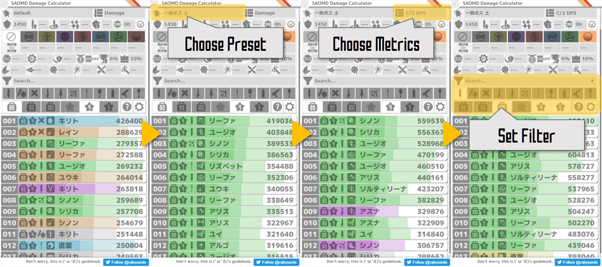
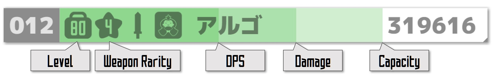
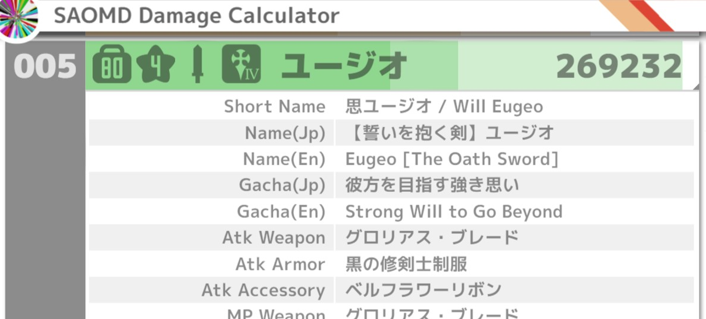
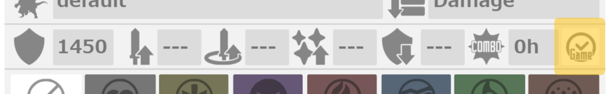
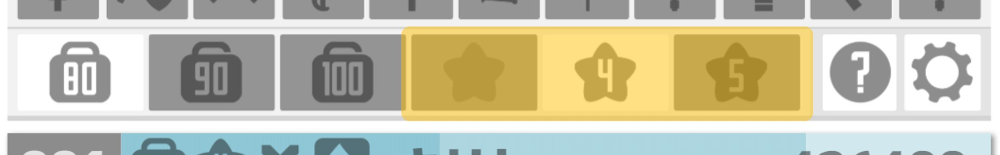
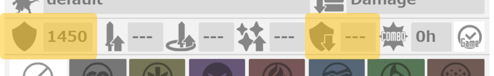
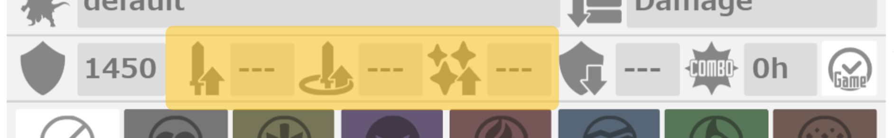
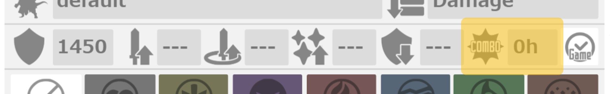
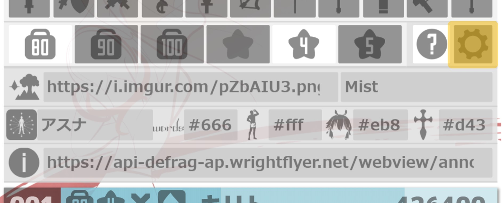

## 간단한 사용법
1. 보스 프리셋을 선택
1. 평가 기준(Metrics)을 선택
1. 필요에 따라서 필터를 설정
1. 캐릭터 리스트를 체크

## 캐릭터 리스트와 평가 기준
### 캐릭터 리스트 보는 방법
캐릭터 리스트는 오른쪽 위의 리스트에서 선택한 평가 기준별로 정렬됩니다. 각각의 평가 기준에 대한 설명은 다음 목차인 [캐릭터 평가 기준](#캐릭터-평가-기준)을 참조하세요. 캐릭터 리스트에서 캐릭터 정보는 다음과 같이 레벨과 무기 레어리티, [가챠 아이콘](#banners)과 화력 성능을 3단계 색으로 구분한 지표로 나타냅니다. 표시되는 수치는 선택한 평가 기준에 따라 다릅니다.

지표를 보는 것으로 선택한 평가 기준 이외의 성능 차이를 알 수 있습니다. 예를 들어 다음 그림의 Damage를 기준으로 정렬된 캐릭터 리스트를 보면 최상위는 언제나 스킬 커넥트 키리토로 되어 있지만, 다른 캐릭터와 비교하면 DPS가 낮고 스킬 한방에 입힐 수 있는 대미지는 높아도 모션이 길어서 랭킹 이벤트에 적합하지 않다는 것을 알 수 있습니다. 또한, 밴드 리파와 마음 유지오를 비교해 보면 둘이 입히는 대미지는 거의 같지만, 액셀 유무로 인해 DPS에서 큰 차이가 나는 것이나 최대 MP량의 차이로 Capacity에서 차이가 나는 것을 알 수 있습니다.

캐릭터 리스트의 지표를 클릭하면 세부 내용을 확인할 수 있습니다. 지표의 오른쪽 아래에 검은 삼각형이 달린 캐릭터는 세부 내용에 [스킬 영상](https://twitter.com/search?src=typd&q=%23S3%E7%99%BA%E5%8B%95%E6%99%82%E9%96%93)이 있는 캐릭터입니다.

### 캐릭터 평가 기준
메모디프의 랭킹 이벤트는 "보스를 가능한 한 빠르게 쓰러트리는 이벤트"인 경우가 많아서 캐릭터를 평가하는 데 있어 스킬 한방에 입히는 대미지 양 뿐만 아니라 모션이 지속되는 시간(Duration)을 고려한 DPS(Damage Per Second:1초당 입히는 대미지)가 가장 중요합니다. 메모디프는 ★5 구현 이후, 연계를 통해서 스킬을 사용하는 중간에 다른 캐릭터의 스킬을 사용하는 것이 가능해져서 이것들도 고려해서 DPS를 계산할 필요가 있습니다. 화력 계산기에서는 이러한 DPS를 계산하기 위해서 시전 시간을 나타내는 변수를 독자적으로 정의하고 있습니다. 시전 시간이나 대미지 계산 사양과 대표적인 캐릭터 평가 기준에 대한 설명은 다음 항목에 표기했습니다.

랭킹 이벤트 등에서 응용하려면, C/2 DPS를 확인하는 것으로 캐릭터가 얼마나 강한지를 얼추 측정할 수 있으므로, 우선은 C/2 DPS를 확인해서 캐릭터를 선택한 다음, 화력이 부족하면 Damage를 참조해서 캐릭터를 다시 선택하거나 Duration Gap과 Duration을 참조해서 연계 순서를 최적화하면 됩니다.

#### 시전 시간(Duration) 사양
다음 그림은 파란색과 빨간색 캐릭터로 파빨빨파 순으로 왕복해서 4연계 했을 때의 시간 흐름과 캐릭터의 시전 시간 파라미터를 가시화한 것입니다.

Duration이 스킬 전체의 시전 시간을 나타내며 CSec(Combination Second)가 스킬 사용을 기준으로 연계가 가능해지는 시간입니다. Duration과 CSec는 캐릭터마다 개별 값이 설정되어 있으며, 모션을 처리하면서 생기는 약간의 시스템 지연을 제외하면 고정되어 있습니다. 특히 ★5 이상 캐릭터 성능 평가에서 중요한 것은 C/2 Duration과 이를 바탕으로 한 DPS(C/2 DPS)입니다. C/2는 Combination or Twice의 약자로, C/2 Duration은 ★5 이상 이라면 연계, ★4이라면 SS3을 2연속으로 사용했을 때의 시전 시간을 나타냅니다. 앞의 연계할 때의 시간 흐름 그림을 참조하면 보다 직관적으로 이해가 가능합니다.

★6 이후에는 액셀러레이션을 통해 인게임 시간을 단축하는 요소가 추가되어서 액셀러레이션 지속시간도 데이터로 참조하고 있습니다. 액셀러레이션은 인게임 시간을 실시간으로 1/3으로 단축하고 액셀러레이션 시간도 연계와 마찬가지로 스킬을 사용한 순간부터 고정된 지속시간이 설정되어 있습니다. 따라서 인게임에서의 Duration과 CSec는 아래와 같이 계산할 수 있습니다.

$$
\begin{aligned}
{Duration_{ingame}}&={Accel}/3+Duration_{realtime}-{Accel}
\\
{CSec_{ingame}}&=
\begin{cases}
{CSec_{realtime}}<{Accel} &CSec_{realtime}/3
\\
{CSec_{realtime}}>{Accel} &{Accel}/3+CSec_{realtime}-{Accel}
\end{cases}
\end{aligned}
$$

DPS 계산에는 인게임 시간을 기본으로 하고 있지만, 화면 오른쪽 위의 토글 스위치를 통해서 인게임 시간과 실제 시간의 전환이 가능합니다.

#### 대미지 계산 사양
대미지는 설정 패널 아래의 무기 장비를 설정하는 범위에서 공격력이 가장 많이 오르는 장비를 장착한 상태에서 계산됩니다. 따라서 보스의 HP가 증가하면서 최대 MP가 중요한 파라미터가 된 현재 환경에서는 실제로 입히는 대미지 보다 약간 높게 나옵니다. 장착 중인 무기와 방어구는 지표를 클릭해서 세부 내용을 표시하면 확인할 수 있습니다. 또한, 방어구나 액세서리도 공격릭이 가장 많이 오르는 것으로 선택되지만, 무기가 없는 상태를 선택했을 때는 방어구와 액세서리도 장착하지 않은 상태로 계산됩니다.

Default 및 Default 50Hit 프리셋 등과 같이 속성 무시를 설정한 경우에는 특정 보스의 속성에 따라서 효과를 발휘하는 BS도 모두 고려해서 계산됩니다.

#### 대표적인 평가 기준

|기준|설명|
|:--|:--|
|Duration|스킬을 사용한 순간부터 스킬 경직이 풀려서 움직일 수 있게 될 때까지의 시전 시간으로, 모션의 빠름이 기준입니다.|
|CSec|스킬을 사용한 순간부터 연계가 가능해질 때까지의 시전 시간으로, 연계 속도가 기준입니다.|
|C/2&nbsp;Duration|Duration과 CSec를 더한 값으로, 예를 들어 연계가 가능한 A와 B라는 두 캐릭터로 ABBA 순으로 왕복해서 4연계했을 때의 A와 B의 스킬 시전 시간입니다. 연계를 할 수 없는 캐릭터일 경우에는 스킬을 2연속으로 사용했을 때의 값（=${Duration}\times2$）입니다.|
|Duration&nbsp;Gap|Duration에서 CSec를 뺀 값으로, Gap이 클수록 선 연계로 했을 때 시간이 많이 단축되므로 선 연계 대상의 적정 기준치가 됩니다. 또한, 연계 후에 선 연계 캐릭터가 화면에 남아있는 시간의 근사값이 됩니다. (화면에 남아 있는 시간은 Duration Gap에 스텝으로 화면 밖으로 나가는 모션을 더한 시간) 기본적으로 Duration Gap이 큰 쪽을 선 연계로 하는 쪽이 전체 시전 시간이 짧아집니다.|
|Damage|입히는 대미지. 화력 평가 기준입니다.|
|DPS|단위 시간(1sec)당 입히는 대미지로, 랭킹 이벤트 평가 기준이 됩니다. ★5 이상은 C/2 DPS를 참조하는 것이 바람직합니다.|
|CDPS|선 연계로 사용했을 때를 가정한 DPS로, 패리 전략 계열 랭킹 이벤트 평가 기준입니다. 연계할 때까지 모든 대미지를 입히고 있다고 판단했을 때의 DPS이므로 주의할 것.|
|C/2&nbsp;DPS|C/2 Duration을 바탕으로 한 DPS로, 랭킹 이벤트에 적정한 범용적인 평가 기준이 됩니다. ABBA 순으로 왕복해서 4연계했을 때의 DPS정도로 이해하면 됩니다.|
|DPM|단위 시간(1min)당 입히는 대미지로, 길드 랭킹 이벤트 평가 기준입니다. MP가 있을 때는 스킬을 사용하고, MP가 부족할 때는 일반 공격 1세트로 MP회복을 반복했을 때 입히는 대미지입니다.|
|Capacity|MP회복 없이 MP를 전부 사용할 때까지 스킬을 사용했을 때 입힌 총 대미지의 유사 값으로, 단단한 보스에 대한 적정 기준치입니다.|
|P.DPS|패리 캔슬을 했을 때의 추정 DPS. 창·지팡이·차지 캐릭터는 패리 캔슬을 통해 패리 모션이 0.2sec 캔슬됐다고 간주하고 DPS를 계산합니다.|
|P.CDPS|패리 캔슬을 했을 때의 추정 CDPS. 창·지팡이·차지 캐릭터는 패리 캔슬을 통해 패리 모션이 0.2sec 캔슬됐다고 간주하고 DPS를 계산합니다.|

#### 대표적인 평가 기준 계산방법

|기준|계산방법|
|:--|:--|:--|
|Duration|${Duration}$|
|CSec|${CSec}$|
|C/2&nbsp;Duration|$$\begin{aligned} \begin{cases} ★6,★5 & {Duration}+{CSec} \\ otherwise & {Duration}\times2\end{cases} \end{aligned}$$|
|Duration&nbsp;Gap|${Duration}-{CSec}$|
|Damage|${Damage}$|
|DPS|${Damage}/{Duration}$|
|CDPS|${Damage}/{CSec}$|
|C/2&nbsp;DPS|$2\cdot{Damage}/{\it C2Duration}$|
|DPM|${Damage}\cdot{\it SS3TimesPer60s}$, 여기에서${\it SS3TimesPer60s}$는 일반 공격의 시전 시간과 MP회복량을 고려해서 계산합니다.|
|Capacity|${Damage}\cdot{MP_{max}}/{MP_{cost}}$|
|P.DPS|${Damage}/({Duration}-0.2)$|
|P.CDPS|${Damage}/({CSec}-0.2)$|

## 보스 프리셋과 설정
입히는 대미지는 보스의 속성과 캐릭터의 속성 상성, 방어력, 특수한 추가대미지나 내성에 따라 변하므로, 적절하게 설정하는 것으로 캐릭터의 유리함·불리함을 보다 정확하게 알 수 있습니다. 반면 이쪽은 설정해야 하는 파라미터가 많으므로, 전형적인 보스나 최신 랭킹 이벤트 전용 프리셋을 준비해놓았습니다. 우선은 프리셋의 설정 내용을 확인하면서 각종 보스의 파라미터 설정에 익숙해지는 것이 좋습니다.

특히 사용 빈도가 높은 부분은 설정 패널 맨 위의 디버프와 버프, 콤보 관련 설정인데, 우선은 이 파라미터만 설정할 수 있게 되어도 좋습니다.

### 방어력과 디버프 설정
방어력은 상세한 조사가 필요하므로 프리셋을 참조하는 것이 좋습니다. 스스로 방어력을 측정할 때는 [방어력 측정](../knowledge/#방어력-측정)을 참조하세요. 디버프는 적이 디버프를 받은 상태에서 화력을 낼 수 있는 캐릭터를 찾을 때 설정합니다. 디버프 값은 방어력 감소율이므로 값이 낮을수록 대미지 증가 효과가 높다는 점을 유의해주세요.

### 공격력과 버프 설정
전체 버프나 연계 버프를 받은 상태에서 화력을 낼 수 있는 캐릭터를 찾을 때 설정합니다. 이때 자기 공격 버프를 가지고 있는 캐릭터는 설정한 공격 버프와 비교해서 둘 중에 효과가 높은 쪽을 우선해서 계산됩니다. 또한, 자기/전체 공격 버프와 장판(범위) 버프는 효과가 중첩됩니다.

### 콤보 보정 설정
스킬을 사용할 때의 콤보 히트 수를 설정합니다. 콤보에 의한 보정은 대미지뿐만 아니라 쌍검과 같이 콤보 가속에 따른 Duration 감소도 계산되므로 DPS 등에 변화가 있습니다. 특히 최근 랭킹 이벤트에서는 첫 패리 전에 콤보를 쌓는 전략이 주류가 되었기 때문에 설정할 기회가 많습니다.

### 설정 항목 일람

|항목|설정 설명|
|:--:|:--|
||보스의 방어력. 최근 랭킹 이벤트에서는 700 전후가 많습니다. 디버프가 필수면 4000 전후.|
||전체 공격 버프. 자세한 것은 [대표적인 공격력 버프와 디버프 효과](#대표적인-공격력-버프와-디버프-효과)를 참조하세요.|
||장판 공격 버프. 자세한 것은 [대표적인 공격력 버프와 디버프 효과](#대표적인-공격력-버프와-디버프-효과)를 참조하세요.|
||크리티컬 대미지 업. 현재 상태에서 확인된 것은 대미지+10% 효과뿐 입니다.|
||디버프에 의한 방어력 감소율. 자세한 것은 [대표적인 공격력 버프와 디버프 효과](#대표적인-공격력-버프와-디버프-효과)를 참조하세요.|
||콤보 수를 설정합니다. 대미지 보정과 콤보 가속에 의한 Duration감소가 계산됩니다.|
||추가 속성 보정. 보스 속성과 캐릭터 속성의 주요 속성 궁합 보정은 상단의 속성 설정에 따라 일정하게 +50/-25%의 보정이 걸려 있습니다.|
||빨간 Weak가 표시될 때처럼, 패리 보너스나 스턴 보너스 보정입니다.|
||그 외의 대미지 보정. 일반적으로 패리 없이 일반 공격으로 resist가 표시될 때의 대미지 내성을 설정합니다.|
||랭킹 이벤트 등에서 상시 가드를 가진 보스일 때. 대체로 3으로 고정됩니다.|
||랭킹 액세서리에 의한 대미지 보정. 액세서리는 정밀하게 계산을 하지 않으며, 공격력이 가장 많이 오르는 액세서리에 이 설정으로 추가된 랭킹 액세서리 보정이 더해집니다.|
||칭호에 의한 공격력 보정.|
||리더 스킬과 서브 리더 스킬에 의한 공격력 보정.|

### 대표적인 공격력 버프와 디버프 효과

|종류|공격력 보정|방어력 보정|보충|
|--|:--:|:--:|--|
|강화&nbsp;연계&nbsp;버프|33%||강화를 끝낸 연계 버프 캐릭터|
|중간&nbsp;연계&nbsp;버프|27%||랭킹 보상 연계 버프 캐릭터|
|연계&nbsp;버프|21%||강화하지 않은 연계 버프 캐릭터|
|강화&nbsp;치어리더|27%||강화를 끝낸 치어리더 캐릭터|
|강화&nbsp;전체&nbsp;버프|21%||강화하지 않은 치어리더, ★6 전체 버프 캐릭터|
|강화&nbsp;장판&nbsp;버프|21%||★6 장판 버프 캐릭터|
|전체&nbsp;버프|16%|||
|장판&nbsp;버프|16%|||
|해적&nbsp;버프|16%|52％|해적 캐릭터|
|약한&nbsp;디버프||63％|신부19 사치|
|디버프||44％||
|중간&nbsp;디버프||34％|풍요(토속성) 유우키|
|강화&nbsp;디버프||29％|강화를 끝낸 코스프레(직업) 캐릭터|

## 앱 설정
설정 패널의 우측 아래에 있는 토글 스위치로 앱 설정 패널을 표시할 수 있습니다. 설정 항목은 브라우저마다 저장됩니다.

|항목|설명|
|:--:|:--|
||배경 설정. 좌측에 그림 URL을 지정. 오른쪽은 이펙트를 선택. 이펙트는 Mist로 전체적으로 하얗게, Smoke로 어둡게 해서 대비를 줄이는 것으로 가시성을 높일 수 있습니다. 또한, 저해상도 배경을 이용할 때는 Line이나 Grid로 설정하는 것이 좋습니다.|
||테마 프리셋. 테마라고 해도 변하는 것은 최상단의 타이틀 색뿐입니다. 프리셋 일람은 [Characters](#characters)를 참조하세요.|
||타이틀 바의 문자 색입니다.|
||타이틀 바의 배경 색입니다.|
||타이틀 바의 하이라이트 1.|
||타이틀 바의 하이라이트 2.|
||PC처럼 가로가 긴 화면일 경우 사이드 바에 지정한 URL을 표시할 수 있습니다. 공지를 설정하는 것을 추천합니다. 메모디프 공지 ([일본어](https://api-defrag.wrightflyer.net/webview/announcement?phone_type=2) : [영어](https://api-defrag-ap.wrightflyer.net/webview/announcement?phone_type=2&lang=en) : [중국어](https://api-defrag-ap.wrightflyer.net/webview/announcement?phone_type=2&lang=tc) : [한국어](https://api-defrag-ap.wrightflyer.net/webview/announcement?phone_type=2&lang=kr))|




